# Secure APIs by Design: A Guide to TLS, Validation & Rate Limiting with OpenAPI

_Build secure APIs from the ground up using OpenAPI security contracts and automated governance._

---

## Key Takeaways

Many teams discover security vulnerabilities after they're already in production, but it doesn't have to be that way!

In this guide, we'll walk though how to turn your OpenAPI specification into a security contract that actually gets enforced. We'll give some tips and tricks on setting up TLS encryption, implementing input validation, defining rate limiting policies, and configuring access control. By the time you're done, you'll know how to catch some security issues during the design phase instead of scrambling to fix them once they're in production.

**We'll cover how to:**
- Transform your OpenAPI specs into executable security policies
- Automate security enforcement in your CI/CD pipeline
- Reduce vulnerability discovery time (from months to minutes in some cases)
- Build APIs that are secure by design upfront

---

## From Reactive Patching to Proactive API Security

High-profile data breaches frequently trace back to insecure APIs, exposing a fundamental flaw in traditional security approaches. The conventional method — identifying and patching vulnerabilities in production — is reactive, costly, and ultimately inadequate. In it's typical (and more common then we'd like) form, this paradigm treats security as more of an afterthought.

### OpenAPI as Your Security Contract

The core of this strategy is treating your OpenAPI specification not as only documentation, but also as an executable security contract. This contract declaratively defines the complete set of security requirements, constraints, and policies before any application code is written. It becomes the single source of truth that dictates how an API must behave to be considered secure.

However, a contract, much like a law, is only as strong as its enforcement. This is where [Redocly CLI](https://redocly.com/docs/cli/) governance and linting capabilities can provide value by making your contract into dynamic, automated guardrails that validate security requirements at every stage of development.

*OpenAPI specifications are validated by Redocly governance engine in CI/CD pipeline, failing builds for security violations and requiring fixes before deployment.*

## Building Secure API Infrastructure: The Technical Foundation

Building secure APIs doesn't have to feel like playing whack-a-mole with vulnerabilities. Once you shift from reactive patching to proactive design, you'll wonder why you ever did it any other way. Let's explore how to make security an automatic part of your API development process.

Let's look at 4 key areas:

1. **TLS Encryption** - Protecting data in transit with enforced HTTPS
2. **Input Validation** - Rejecting malicious data through schema contracts  
3. **Rate Limiting** - Preventing abuse with documented policies
4. **Access Control** - Defining authentication and authorization schemes

Where these areas are codified in your OpenAPI specification and enforced through automated governance, they provide a foundation for APIs that are secure by design - something we very much endorse!

```mermaid
graph TD
    A["🏛️ Secure API Foundation"] --> B["🔐 TLS Encryption<br/>Data in Transit"]
    A --> C["✅ Input Validation<br/>Schema Contracts"]
    A --> D["⚡ Rate Limiting<br/>Abuse Prevention"]
    A --> E["🔑 Access Control<br/>Auth & Authorization"]
    
    B --> F["• HTTPS Enforcement<br/>• Certificate Management<br/>• Strong Cipher Suites"]
    C --> G["• JSON Schema Rules<br/>• Type Validation<br/>• Length Constraints"]
    D --> H["• x-rate-limit Extensions<br/>• 429 Response Headers<br/>• Multi-tier Limits"]
    E --> I["• Security Schemes<br/>• JWT/OAuth2<br/>• Scope Management"]
    
    J["📄 OpenAPI 3.1<br/>Specification"] --> A
    K["⚙️ Redocly<br/>Governance"] --> A
    
    style A fill:#e8f5e8
    style B fill:#e3f2fd
    style C fill:#fff3e0
    style D fill:#fce4ec
    style E fill:#f1f8e9
    style J fill:#e1f5fe
    style K fill:#f3e5f5
```



*Architecture diagram showing the four essential areas of API security (TLS encryption, input validation, rate limiting, access control) supported by OpenAPI specifications and Redocly governance automation.*

## TLS Encryption: Protecting Data in Transit with OpenAPI

When a client and an API exchange information, that data travels across the internet, a public network. Without protection, this data gets intercepted and read by malicious actors. This is where encryption comes in.

> **The Banking Vault Principle**: When banks transfer large sums between branches, they don't send cash in regular envelopes. They use armored vehicles with multiple security layers. TLS encryption works similarly — it creates a secure transport layer that protects your API data during transit, even across untrusted networks.

**Encryption in transit** works similarly, creating a secure, private tunnel for API data as it moves between the client and the server.

### TLS 1.3: The Modern Standard

This secure tunnel is primarily established using Transport Layer Security (TLS) version 1.3, as specified in IETF RFC 8446. Any modern API security guidance must unequivocally mandate TLS 1.3, as older protocols—including all versions of SSL, TLS 1.0, and TLS 1.1—are deprecated and considered insecure due to known vulnerabilities.

When a client connects to an API over `https://`, it initiates a "TLS handshake." During this handshake, the client and server perform crucial steps:

1. **Authentication:** The server presents its TLS certificate to the client to prove its identity, ensuring the client is talking to the legitimate server and not an impostor.  
2. **Agreement on Encryption:** They agree on a set of cryptographic algorithms (a "cipher suite") to use for the session.  
3. **Key Exchange:** They securely generate and exchange unique session keys that will be used to encrypt and decrypt all data for the remainder of the conversation.

We're not going to get all the way into it in this article, but here is what the handshake looks like:

### TLS Handshake Process

```mermaid
sequenceDiagram
    participant C as Client
    participant S as Server
    
    Note over C,S: TLS Handshake Process
    
    C->>S: 1. Client Hello (Supported cipher suites)
    
    S->>C: 2. Server Hello + Certificate
    Note right of S: Server presents TLS certificate to prove identity
    
    C->>C: 3. Certificate Validation
    Note left of C: Client verifies server certificate is trusted
    
    C->>S: 4. Cipher Suite Selection
    Note over C,S: Both agree on cryptographic algorithms
    
    C->>S: 5. Key Exchange
    S->>C: 6. Key Exchange Complete
    Note over C,S: Generate and exchange unique session keys
    
    Note over C,S: 🔒 Secure Communication Begins
    
    C->>S: Encrypted API Request
    S->>C: Encrypted API Response
    
```



*Sequence diagram illustrating the TLS handshake process between client and server, showing certificate validation, cipher suite selection, and secure key exchange that ensures encrypted API communication.*

### TLS Security Guarantees

TLS, when done right, provides three essential security guarantees:

* **Confidentiality:** It encrypts the data, preventing eavesdroppers from reading it.  
* **Integrity:** It ensures that the data has not been altered or tampered with during transit.  
* **Authentication:** It verifies the identity of the server, protecting against man-in-the-middle attacks.

This is why secure APIs always use URLs that start with `https://` instead of `http://`. The 's' stands for 'secure' and indicates that the connection is protected by TLS encryption.

### TLS Implementation Best Practices

In our production environments, we've learned that telling teams to "use HTTPS" without specifics sometimes leads to misconfigured TLS and a false sense of security. Proper TLS implementation requires:

* **Enforcing Strong Cipher Suites**: Configure servers to only negotiate cryptographic algorithms that are considered secure, disabling weak or obsolete ciphers
* **Proper Certificate Management**: Use certificates from trusted Certificate Authorities (CAs), ensure they are not expired, and implement robust processes for certificate issuance, renewal, and revocation
* **Protection Against Man-in-the-Middle (MiTM) Attacks**: Implement HTTP Strict Transport Security (HSTS) to instruct browsers to only communicate over HTTPS, preventing protocol downgrade attacks

#### Common TLS misconfigurations

* Weak or legacy protocols enabled (SSL, TLS 1.0/1.1) — disable them explicitly
* Missing HSTS header — add Strict-Transport-Security with long max-age
* Mixed content or accidental HTTP endpoints — redirect to HTTPS at the edge
* Expiring certificates — monitor expiry and automate renewal

Quick checks:

```bash
# Verify protocol and cipher suites
openssl s_client -connect api.example.com:443 -tls1_3 -cipher 'TLS_AES_256_GCM_SHA384' < /dev/null | grep -E 'Protocol|Cipher'

# Scan for common TLS issues
testssl.sh --fast https://api.example.com
```

> Expert insight: "Treat TLS as a product with owners and SLAs. We track TLS health on dashboards the same way we track latency and errors."

### Enforcing HTTPS in Your API Specification

The security contract for encrypted transit begins within the `servers` object of your OpenAPI specification. Every URL defined here must use the `https://` scheme—this isn't just documentation, it's a formal declaration of your API's secure endpoints.

**OpenAPI Servers Declaration:**
```yaml
# openapi.yaml
servers:
  - url: https://api.production.com/v1
    description: Production Server
  - url: https://api.staging.com/v1
    description: Staging Server
```

**Redocly Governance Enforcement:**

For complete configuration options, see the [Redocly CLI configuration guide](https://redocly.com/docs/cli/configuration/).

```yaml
# redocly.yaml - Advanced TLS enforcement
extends:
  - recommended

rules:
  # Built-in rule: Ensure HTTPS usage
  no-http-verbs-in-paths: error
  
  # Custom rule: Enforce production domain patterns
  rule/enforce-production-tls:
    subject:
      type: Server
      property: url
    assertions:
      pattern: "^https://api\\.(production|staging)\\.com"
    message: "Server URLs must use https:// and point to approved domains."
    severity: error
```

When integrated into your CI/CD pipeline, this configuration creates an automated security gate. If a developer attempts to commit an OpenAPI file with `http://api.production.com` or `https://api.dev.internal`, the pipeline fails with a clear error message, preventing insecure configurations from ever reaching production.

*Redocly governance fails a CI/CD build if an OpenAPI spec uses HTTP instead of HTTPS, requiring developers to fix security violations before deployment.*

### TLS Configuration Examples

**Nginx Configuration:**
```nginx
server {
    listen 443 ssl http2;
    server_name api.example.com;
    
    # TLS 1.3 only
    ssl_protocols TLSv1.3;
    
    # Strong cipher suites
    ssl_ciphers TLS_AES_256_GCM_SHA384:TLS_CHACHA20_POLY1305_SHA256:TLS_AES_128_GCM_SHA256;
    
    # HSTS header
    add_header Strict-Transport-Security "max-age=31536000; includeSubDomains" always;
    
    # Certificate files
    ssl_certificate /path/to/certificate.crt;
    ssl_certificate_key /path/to/private.key;
}
```

**Express.js Configuration:**
```javascript
const https = require('https');
const fs = require('fs');
const express = require('express');

const app = express();

// HSTS middleware
app.use((req, res, next) => {
  res.setHeader('Strict-Transport-Security', 'max-age=31536000; includeSubDomains');
  next();
});

const options = {
  key: fs.readFileSync('private.key'),
  cert: fs.readFileSync('certificate.crt'),
  // Force TLS 1.3
  secureProtocol: 'TLSv1_3_method'
};

https.createServer(options, app).listen(443);
```

### Attack Example: Heartbleed (TLS library vulnerability, 2014)

These attacks are both real and can be problematic. Heartbleed (CVE-2014-0160) allowed attackers to read server memory via malformed TLS heartbeat messages. Real incidents, including the Canada Revenue Agency breach, demonstrated how secrets (keys, cookies) could be exfiltrated.


*Sequence diagram showing the Heartbleed attack: malformed TLS heartbeat requests cause vulnerable OpenSSL servers to leak memory contents including encryption keys and session data.*

Why this matters: TLS is only as strong as its implementation. Monitoring and rapid patching for library CVEs are part of infrastructure security.

### Mutual TLS (mTLS): Two-Way Authentication

While standard TLS only authenticates the server to the client, **Mutual TLS (mTLS)** requires both parties to authenticate each other using certificates. This provides stronger security for high-trust scenarios like service-to-service communication.

**mTLS Use Cases:**
- Microservice communication in zero-trust architectures
- API-to-API authentication between organizations
- IoT device authentication
- High-security financial and healthcare APIs

**OpenAPI mTLS Configuration:**
```yaml
# openapi.yaml
components:
  securitySchemes:
    mtlsAuth:
      type: mutualTLS
      description: "Client certificate authentication"

# Apply to sensitive operations
paths:
  /internal/payments:
    post:
      security:
        - mtlsAuth: []
      summary: "Process payment (internal service only)"
```

**Implementation Example (Nginx):**
```nginx
server {
    listen 443 ssl http2;
    
    # Server certificate
    ssl_certificate /path/to/server.crt;
    ssl_certificate_key /path/to/server.key;
    
    # Require client certificates
    ssl_verify_client on;
    ssl_client_certificate /path/to/ca.crt;
    
    # Pass client certificate info to backend
    proxy_set_header X-Client-Cert $ssl_client_cert;
    proxy_set_header X-Client-Verify $ssl_client_verify;
}
```

> **mTLS Best Practice**: Use mTLS for service-to-service communication and regular TLS + JWT/OAuth2 for client-to-server communication.

---

## Input Validation: Preventing Injection Attacks with Schema-Based Security

APIs are designed to accept data as input. However, an API should never blindly trust the data it receives from a client. The process of rigorously checking all incoming data is called data validation. NIST defines data validation as "The process of determining that data...is acceptable according to a predefined set of tests and the results of those tests."

### The Restaurant Waiter Analogy

> **The Restaurant Waiter**: The API is the waiter, and its documentation (or schema) is the menu. The menu explicitly states what can be ordered and in what format (e.g., "Steak - medium rare"). If a customer tries to order something not on the menu, like "a bicycle," or provides an invalid option, like "a million steaks," a competent waiter will immediately reject the order at the table before it ever reaches the kitchen. This is data validation.

### Technical Implementation of Data Validation

In technical terms, data validation is the practice of checking all incoming data from a client to ensure it conforms to the expected format, type, range, and other constraints before it is processed by the application's business logic.

For example, if an API endpoint expects a user's age, validation rules should ensure the input is an integer and falls within a reasonable range (e.g., 0-130).

Proper data validation is a critical defense against a wide range of attacks, notably **Injection flaws**. An injection attack occurs when a malicious actor sends executable code disguised as data.

If the API fails to validate the input and passes it directly to a database or the operating system, that malicious code could be executed. By strictly validating that all inputs are what they are supposed to be, an API can reject malicious payloads before they can do any harm.

### SQL Injection Prevention

For interactions with a database, the gold standard for preventing SQL injection attacks is the use of parameterized queries, also known as prepared statements.

A parameterized query forces a separation between the SQL command (the code) and the user-supplied data, making it impossible for an attacker to alter the logic of the query.

**Vulnerable Code (Never Do This):**
```python
# DANGEROUS: Directly interpolating user input
user_id = request.get('user_id')
query = f"SELECT * FROM users WHERE id = {user_id}"
cursor.execute(query)
```

**Secure Code (Use Parameterized Queries):**
```python
# SAFE: Using parameterized queries
user_id = request.get('user_id')
query = "SELECT * FROM users WHERE id = ?"
cursor.execute(query, (user_id,))
```

### Schema-Based Validation as Security Contract

OpenAPI 3.1 provides a comprehensive vocabulary for defining strict validation rules by leveraging JSON Schema Draft 2020-12. By codifying these rules directly in your API specification, validation becomes core to your API's design.

**Secure Schema Example:**
```yaml
# openapi.yaml
components:
  schemas:
    NewUser:
      type: object
      additionalProperties: false  # Prevent mass assignment
      required:
        - username
        - email
        - password
        - age
      properties:
        username:
          type: string
          minLength: 4
          maxLength: 20
          pattern: "^[a-zA-Z0-9]+$"  # Alphanumeric only
        email:
          type: string
          maxLength: 254
          format: email
        password:
          type: string
          minLength: 12
          maxLength: 128
        age:
          type: integer
          minimum: 18
          maximum: 130
        role:
          type: string
          enum: ["user", "viewer"]
          default: "user"
```

**Redocly Governance for Validation:**

Detailed rule configuration is available in the [Redocly CLI rules documentation](https://redocly.com/docs/cli/rules/).

```yaml
# redocly.yaml - Enforce security validation standards
extends:
  - recommended-strict

rules:
  # Rule 1: All strings must have length bounds
  rule/string-must-have-maxLength:
    subject:
      type: Schema
    where:
      - subject:
          property: type
        assertions:
          const: string
    assertions:
      required:
        - maxLength
    message: "All string properties must have 'maxLength' to prevent resource exhaustion."
    severity: error

  # Rule 2: All numbers must have ranges  
  rule/number-must-have-range:
    subject:
      type: Schema
    where:
      - subject:
          property: type
        assertions:
          enum: [number, integer]
    assertions:
      required: [minimum, maximum]
    message: "Numeric properties must have 'minimum' and 'maximum' defined."
    severity: error

  # Rule 3: Prevent mass assignment vulnerabilities
  rule/no-additional-properties:
    subject:
      type: Schema
    where:
      - subject:
          property: type
        assertions:
          const: object
    assertions:
      property:
        additionalProperties:
          const: false
    message: "Objects must set 'additionalProperties: false' to prevent mass assignment."
    severity: error
```

This governance approach changes security reviews. Instead of manually checking many properties for missing `maxLength` constraints, automated linting with [Redocly Workflows](https://redocly.com/workflows) handles baseline validation so security teams can focus on strategic concerns like business logic and context-dependent risks.

### JSON Schema Security Keywords


* Keyword
* Purpose  
* Security Implication
---
* `type`
* Constrains data type
* Prevents type confusion attacks
---
* `pattern`
* Enforces regex on strings
* Fine-grained control against injection
---
* `maxLength/minLength`
* Constrains string/array length
* Mitigates DoS and buffer overflow
---
* `maximum/minimum`
* Constrains numeric ranges
* Prevents integer overflows
---
* `enum`
* Restricts to predefined values
* Blocks unexpected/malicious values
---
* `required`
* Mandates property presence
* Ensures critical data elements exist
---
* `additionalProperties: false`
* Prohibits undeclared properties
* Defense against mass assignment


### Common Validation Patterns


* Input Type
* Validation Rules
* Example
---
* Email
* RFC 5322 format
* `user@example.com`
---
* Phone
* E.164 format
* `+1234567890`
---
* URL
* Valid URL scheme
* `https://example.com`
---
* UUID
* Standard UUID format
* `123e4567-e89b-12d3-a456-426614174000`
---
* Date
* ISO 8601 format
* `2025-01-20T10:30:00Z`
---
* Password
* Minimum complexity
* 8+ chars, mixed case, numbers, symbols


#### Validation troubleshooting and common pitfalls

* Missing bounds (no `maxLength`, no numeric ranges) — leads to resource exhaustion
* Overly permissive regex patterns — allow unwanted characters and injection payloads
* Validating at the wrong layer — front-end only, or after DB calls
* Accepting undeclared properties — enables mass assignment

Quick fixes:

```yaml
# JSON Schema example: tighten strings and numeric bounds
type: object
additionalProperties: false
properties:
  name:
    type: string
    minLength: 1
    maxLength: 100
    pattern: "^[a-zA-Z\\s]+$"
  age:
    type: integer
    minimum: 0
    maximum: 130
```

> Redocly insight: "We block PRs that add new string fields without `maxLength`. It's the cheapest guardrail against abuse."

### Attack Example: Equifax (OGNL injection via Apache Struts, 2017)

Here's another one. An input validation and deserialization flaw (CVE-2017-5638) in Apache Struts allowed attackers to inject OGNL expressions via the `Content-Type` header, leading to remote code execution and data exfiltration.


*Sequence diagram illustrating the Equifax breach: attacker exploited Apache Struts vulnerability through OGNL injection in Content-Type headers, bypassing WAF and executing code to steal personal data.*

Why this matters: Strong schema validation, input allow-lists, and patch hygiene block entire classes of injection attacks.

---

## Rate Limiting: Preventing DoS and Abuse with API Policies

A single client, whether intentionally malicious or simply due to a bug in its code, can send a massive number of requests to an API in a short period. This can overwhelm the server, degrading performance for all other users or even causing the service to crash. Rate limiting is the primary defense against this scenario.

### The Library Card Analogy

> **The Library Card**: A library card allows a patron to check out a maximum of ten books per month. Once that limit is reached, the system will not allow any more checkouts until the next month begins, regardless of how many times the patron asks.

**Rate limiting** applies this same principle to an API. It establishes a policy that restricts the number of requests a single client can make within a specific time window (e.g., 100 requests per minute).

### Documenting Rate Limits in OpenAPI

While OpenAPI 3.1 doesn't include native rate-limiting objects, extension properties (prefixed with `x-`) provide a standard mechanism. The best practice is defining custom `x-rate-limit` extensions at the operation level:

```yaml 
paths:
  /auth/login:
    post:
      summary: User Login
      tags: [Authentication]
      # Define rate-limiting policy for this sensitive endpoint
      x-rate-limit:
        limit: 5
        window: "1m"
        scope: "ip_address"
        description: "Limits login attempts to 5 per minute per IP to prevent brute-force attacks."
      responses:
        '200':
          description: "Successful login."
        # Document the 429 response with proper headers
        '429':
          description: "Too Many Requests. Rate limit exceeded."
          headers:
            Retry-After:
              schema:
                type: integer
              description: "Seconds to wait before making a new request."
            X-RateLimit-Limit:
              schema:
                type: integer
              description: "Maximum requests permitted in the window."
            X-RateLimit-Remaining:
              schema:
                type: integer
              description: "Requests remaining in current window."
```

**Redocly Governance for Rate Limiting:**
```yaml
# redocly.yaml
rules:
  # Require rate limits on authentication endpoints
  rule/require-rate-limit-on-auth:
    subject:
      type: Operation
    where:
      - subject:
          property: tags
        assertions:
          contains: "Authentication"
    assertions:
      defined:
        - x-rate-limit
    message: "Authentication operations must have 'x-rate-limit' policy defined."
    severity: error
```

This approach provides dual benefits: [Redocly's Redoc](https://redocly.com/redoc) automatically displays the `x-rate-limit` object in generated documentation, making policies transparent to API consumers, while governance rules ensure sensitive endpoints never lack rate-limiting policies.

### Why Rate Limiting Is Critical

Rate limiting serves two crucial purposes:

1. **Security:** It is a vital defense against automated attacks. It can thwart **Denial-of-Service (DoS)** attacks, where an attacker attempts to make a service unavailable by flooding it with traffic, which relates to **API4:2023 - Unrestricted Resource Consumption**. It also makes **brute-force** attacks against authentication endpoints (i.e., guessing passwords) much slower and less effective. Furthermore, it helps mitigate business logic abuse by preventing bots from, for example, scraping all product pricing data or buying up an entire inventory of limited-stock items, addressing **API6:2023 - Unrestricted Access to Sensitive Business Flows**.
2. **Reliability and Fair Usage:** It ensures that the API remains stable and responsive for all users by preventing any single client from monopolizing server resources. This guarantees a better and more equitable quality of service for everyone.

### Rate Limiting Implementation Approaches

**Common Algorithm Types:**
- **Token Bucket**: Allows burst traffic within limits, refills at steady rate
- **Sliding Window**: Precise per-window enforcement with distributed request tracking
- **Fixed Window**: Simple per-timeframe limits, prone to boundary conditions

**Multi-tier Strategy:**
```yaml
# API Gateway configuration example
rate_limits:
  global:
    requests_per_minute: 1000
    requests_per_hour: 10000
  by_endpoint:
    "/auth/*":
      requests_per_minute: 5
      requests_per_hour: 20
    "/api/data":
      requests_per_minute: 100
```

### Advanced Rate Limiting Techniques

**Multi-tier Rate Limiting:**
```yaml
# API Gateway configuration (Kong example)
plugins:
- name: rate-limiting
  config:
    minute: 100        # 100 requests per minute per IP
    hour: 1000         # 1000 requests per hour per IP
    policy: redis      # Use Redis for distributed rate limiting
    fault_tolerant: true
    hide_client_headers: false

# Per-endpoint overrides
- name: rate-limiting
  route: auth-endpoints
  config:
    minute: 5          # Stricter limits for auth endpoints
    hour: 20
```

**Client-side Exponential Backoff:**
```javascript
class APIClient {
  async makeRequest(url, options, retries = 3) {
    try {
      const response = await fetch(url, options);
      
      if (response.status === 429) {
        const retryAfter = response.headers.get('Retry-After');
        const delay = retryAfter ? parseInt(retryAfter) * 1000 : 
                     Math.pow(2, 4 - retries) * 1000; // Exponential backoff
        
        if (retries > 0) {
          await new Promise(resolve => setTimeout(resolve, delay));
          return this.makeRequest(url, options, retries - 1);
        }
        
        throw new Error('Rate limit exceeded');
      }
      
      return response;
    } catch (error) {
      throw error;
    }
  }
}
```

As a complementary practice, the client-side responsibility of implementing exponential backoff should also be noted. When an API client receives a rate-limiting error (e.g., HTTP 429 Too Many Requests), it should wait for an exponentially increasing period of time between retries. This prevents clients from overwhelming the server and helps the system recover gracefully from load spikes.

> **Tip:** Combine per-IP and per-account quotas and require exponential backoff on clients.

### Attack Example: Facebook phone number scraping (2019 dataset)

How has rate limiting mistakes been exploted? Funny you should ask! Here's one that happened at Facebook. Attackers enumerated user data through contact import and related endpoints with insufficient rate limiting and anomaly detection, leading to the aggregation of hundreds of millions of records that later appeared publicly.


*Sequence diagram showing how attackers used Facebook's contact import API to scrape phone numbers at scale, exploiting missing rate limits and velocity checks to harvest personal data.*

Why this matters: Rate limiting, velocity checks, and behavior analytics are core defenses against scraping and credential-stuffing at scale.

---

### Defining Security Schemes in OpenAPI

OpenAPI 3.1 provides a robust framework for defining access control through two primary constructs:

1. **`components.securitySchemes`**: Defines *how* clients can authenticate (JWT Bearer, OAuth2, API Keys)
2. **`security`**: Specifies *that* an endpoint is secured and by which mechanism(s)

**JWT Bearer Token Example:**
```yaml
# openapi.yaml
components:
  securitySchemes:
    bearerAuth:
      type: http
      scheme: bearer
      bearerFormat: JWT
      description: "Enter JWT with 'Bearer ' prefix"

# Apply globally to all operations
security:
  - bearerAuth: []
```

**OAuth2 with Scopes Example:**
```yaml
# openapi.yaml
components:
  securitySchemes:
    oauth2Auth:
      type: oauth2
      description: "OAuth2 Authorization Code Flow with PKCE"
      flows:
        authorizationCode:
          authorizationUrl: https://auth.example.com/authorize
          tokenUrl: https://auth.example.com/token
          scopes:
            'users:read': "Read access to user profiles"
            'users:write': "Modify user profiles"

paths:
  /users/{userId}:
    patch:
      summary: "Update user profile"
      security:
        - oauth2Auth: ['users:write']  # Requires specific scope
```

### Redocly Governance for Access Control

The most critical built-in security rule is `security-defined`, which ensures every operation is covered by a security requirement:

```yaml
# redocly.yaml
extends:
  - recommended

rules:
  # Ensure no endpoint is accidentally left unsecured
  security-defined: error
  
  # Custom rule: Require security on sensitive operations
  rule/require-auth-on-mutations:
    subject:
      type: Operation
    where:
      - subject:
          property: method
        assertions:
          enum: [post, put, patch, delete]
    assertions:
      defined: [security]
    message: "All write operations must have security defined."
    severity: error
```

When `redocly lint` runs, any endpoint without a corresponding `security` block causes the build to fail, preventing the most common API vulnerability: the unintentionally public endpoint.

### Security Definitions as Configuration

Defining security schemes in OpenAPI extends beyond documentation—it establishes configuration-as-code that drives consistency across your entire API ecosystem:

- **API Gateways** (Kong, Apigee) import OpenAPI files and automatically configure JWT validation based on `securitySchemes`
- **Code generators** create boilerplate authentication handling
- **Testing tools** automate authenticated requests
- **Redocly's "Try it" console** renders appropriate UI for each scheme type

This unified approach ensures the security policy defined in design is the same policy implemented, documented, tested, and enforced in production.

#### Access control troubleshooting and common pitfalls

* Missing security definitions — endpoints accidentally left public
* Overly broad scopes — `admin` scope used everywhere instead of granular permissions
* Security schemes not enforced — gateway config doesn't match OpenAPI definition
* Bearer tokens without validation — accepting any JWT without signature verification

Quick checks:

```bash
# Test unauthenticated access (should fail)
curl -i https://api.example.com/users/me

# Test with invalid token (should fail)  
curl -H "Authorization: Bearer invalid" https://api.example.com/users/me

# Test scope enforcement
curl -H "Authorization: Bearer readonly_token" -X POST https://api.example.com/users
```

> Key insight: "The `security-defined` rule has prevented more breaches than any other single control. It's non-negotiable in our CI pipeline." Learn more about implementing this with [Redocly's API Governance solution](https://redocly.com/api-governance).

#### Rate limiting troubleshooting and common pitfalls

* Counting the wrong thing — per-IP only; add per-account and per-token limits
* Same limits for every endpoint — tighten auth and write endpoints separately
* No Retry-After header — clients can't back off predictably
* Stateless limits in distributed systems — use Redis or gateway-native stores

Quick checks:

```bash
# Observe 429 behavior and headers
curl -i https://api.example.com/login | grep -E 'HTTP/|Retry-After'

# Simulate burst to verify buckets/windows
hey -z 10s -q 50 -c 50 https://api.example.com/api/resource
```

> Another insight: "Rate limiting on auth endpoints is non-negotiable. We set 5/min per IP and per account, and alert when bypass attempts appear."

## Monitoring and Observability

### TLS Monitoring
```yaml
# Prometheus alerts for TLS
groups:
- name: tls_alerts
  rules:
  - alert: TLSCertificateExpiringSoon
    expr: probe_ssl_earliest_cert_expiry - time() < 86400 * 30
    labels:
      severity: warning
    annotations:
      summary: "TLS certificate expires in less than 30 days"

  - alert: WeakTLSVersion
    expr: probe_tls_version_info{version!="TLS 1.3"} == 1
    labels:
      severity: critical
    annotations:
      summary: "Weak TLS version detected"
```

### Validation Monitoring
```javascript
// Log validation failures for analysis
app.use((req, res, next) => {
  const originalSend = res.send;
  
  res.send = function(data) {
    if (res.statusCode === 400 && req.validationErrors) {
      logger.warn('Validation failure', {
        endpoint: req.path,
        errors: req.validationErrors,
        clientIP: req.ip,
        userAgent: req.get('User-Agent')
      });
    }
    
    originalSend.call(this, data);
  };
  
  next();
});
```

### Rate Limiting Monitoring
```python
# Track rate limiting metrics
import time
from collections import defaultdict

class RateLimitMetrics:
    def __init__(self):
        self.blocked_requests = defaultdict(int)
        self.total_requests = defaultdict(int)
    
    def record_request(self, client_id, blocked=False):
        self.total_requests[client_id] += 1
        if blocked:
            self.blocked_requests[client_id] += 1
    
    def get_block_rate(self, client_id):
        total = self.total_requests[client_id]
        blocked = self.blocked_requests[client_id]
        return (blocked / total) * 100 if total > 0 else 0
```

## Frequently Asked Questions

### What is design-first API security?
Design-first API security means defining security requirements in your OpenAPI specification before writing code, then using automated governance tools like Redocly to enforce those requirements throughout the development lifecycle. This prevents vulnerabilities from reaching production rather than patching them after discovery.

### How does OpenAPI prevent injection attacks?
OpenAPI specifications define precise data schemas with type validation, format constraints, and length limits. When enforced by governance tools, these schemas automatically reject malformed inputs that could contain injection payloads, stopping attacks before they reach your application logic.

### Why is rate limiting important for API security?
Rate limiting prevents denial-of-service attacks, brute-force authentication attempts, and data scraping. It ensures fair resource usage among legitimate users while blocking malicious automation. Without rate limits, a single bad actor can overwhelm your API infrastructure.

### Can I implement all four security areas with just OpenAPI?
Yes, OpenAPI 3.1 supports all four security areas: TLS enforcement through server URLs, input validation via JSON schemas, rate limiting through extensions like `x-rate-limit`, and access control via security schemes. Combined with governance automation, your specification becomes an executable security contract.

### What's the difference between authentication and authorization in APIs?
Authentication verifies *who* the user is (like checking an ID card), while authorization determines *what* they can do (like checking permissions). Both are essential for API security, and OpenAPI provides security schemes to define and enforce both concepts through your specification.

## Resources

- **[OWASP API Security Top 10](https://owasp.org/www-project-api-security/)** - Complete vulnerability guide including injection and resource consumption attacks
- **[Mozilla TLS Configuration Generator](https://ssl-config.mozilla.org/)** - Generate secure TLS configurations for various web servers and applications
- **[NIST Guidelines for TLS Implementations](https://csrc.nist.gov/publications/detail/sp/800-52/rev-2/final)** - Official guidelines for secure TLS implementation and configuration
- **[Redocly Documentation](https://redocly.com/docs/)** - Complete guide to implementing API governance and automated security validation
