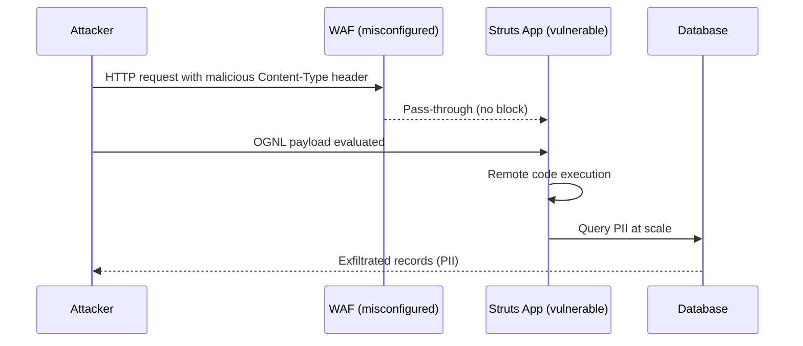

# Input Validation and Injection Prevention with OpenAPI

_Stop injection attacks using OpenAPI schema validation and automated governance rules that reject malicious data before it reaches your application._

---

## Key Takeaways

APIs are designed to accept data as input. However, an API should never blindly trust the data it receives from a client. The process of rigorously checking all incoming data is called data validation.

**In this guide, you'll learn:**
- How to implement schema-based validation as a security contract
- JSON Schema security constraints and validation patterns  
- Mass assignment attack prevention techniques
- SQL injection and OGNL injection defense strategies
- Real-world lessons from the Equifax breach
- Automated validation governance and linting rules

---

## The Restaurant Waiter Principle

> **The Restaurant Waiter**: The API is the waiter, and its documentation (or schema) is the menu. The menu explicitly states what can be ordered and in what format (e.g., "Steak - medium rare"). If a customer tries to order something not on the menu, like "a bicycle," or provides an invalid option, like "a million steaks," a competent waiter will immediately reject the order at the table before it ever reaches the kitchen. This is data validation.

## Technical Implementation of Data Validation

In technical terms, data validation is the practice of checking all incoming data from a client to ensure it conforms to the expected format, type, range, and other constraints before it is processed by the application's business logic.

For example, if an API endpoint expects a user's age, validation rules should ensure the input is an integer and falls within a reasonable range (e.g., 0-130).

Proper data validation is a critical defense against a wide range of attacks, notably **Injection flaws**. An injection attack occurs when a malicious actor sends executable code disguised as data.

If the API fails to validate the input and passes it directly to a database or the operating system, that malicious code could be executed. By strictly validating that all inputs are what they are supposed to be, an API can reject malicious payloads before they can do any harm.

## SQL Injection Prevention

For interactions with a database, the gold standard for preventing SQL injection attacks is the use of parameterized queries, also known as prepared statements.

A parameterized query forces a separation between the SQL command (the code) and the user-supplied data, making it impossible for an attacker to alter the logic of the query.

**Vulnerable Code (Never Do This):**
```python
# DANGEROUS: Directly interpolating user input
user_id = request.get('user_id')
query = f"SELECT * FROM users WHERE id = {user_id}"
cursor.execute(query)
```

**Secure Code (Use Parameterized Queries):**
```python
# SAFE: Using parameterized queries
user_id = request.get('user_id')
query = "SELECT * FROM users WHERE id = ?"
cursor.execute(query, (user_id,))
```

## Schema-Based Validation as Security Contract

OpenAPI 3.1 provides a comprehensive vocabulary for defining strict validation rules by leveraging JSON Schema Draft 2020-12. By codifying these rules directly in your API specification, validation becomes core to your API's design.

**Secure Schema Example:**
```yaml 
components:
  schemas:
    NewUser:
      type: object
      additionalProperties: false  # Prevent mass assignment (OWASP API3:2023)
      required:
        - username
        - email
        - password
        - age
      properties:
        username:
          type: string
          minLength: 4
          maxLength: 20             # Prevent resource exhaustion (OWASP API4:2023)
          pattern: "^[a-zA-Z0-9]+$"  # Prevent injection attacks
        email:
          type: string
          maxLength: 254            # Prevent resource exhaustion (OWASP API4:2023)
          format: email
        password:
          type: string
          minLength: 12
          maxLength: 128
        age:
          type: integer
          minimum: 18
          maximum: 130              # Prevent integer overflow attacks
        role:
          type: string
          enum: ["user", "viewer"]   # Enforce allow-list approach
          default: "user"
```

### Automated Governance for Validation

[Modern API governance tools](api-design-first-security-governance.md) can enforce input validation rules that require string length bounds, numeric ranges, and prevent mass assignment vulnerabilities.

This governance approach transforms security reviews. Instead of manually checking many properties for missing `maxLength` constraints, automated linting tools handle baseline validation so security teams can focus on strategic concerns like business logic and context-dependent risks.

## Key Security Constraints

The most critical schema constraints for API security focus on preventing resource exhaustion and injection attacks:

- **`maxLength`**: Required on all strings to prevent memory exhaustion attacks
- **`maximum/minimum`**: Required on all numbers to prevent integer overflow vulnerabilities  
- **`additionalProperties: false`**: Essential for preventing mass assignment attacks
- **`pattern`**: Use restrictive regex patterns to block injection payloads

These constraints can be automatically enforced by [governance rules](api-design-first-security-governance.md), ensuring no schema can bypass these fundamental protections.

## Common Validation Patterns


* Input Type
* Validation Rules
* Example
---
* Email
* RFC 5322 format
* `user@example.com`
---
* Phone
* E.164 format
* `+1234567890`
---
* URL
* Valid URL scheme
* `https://example.com`
---
* UUID
* Standard UUID format
* `123e4567-e89b-12d3-a456-426614174000`
---
* Date
* ISO 8601 format
* `2025-01-20T10:30:00Z`
---
* Password
* Minimum complexity
* 8+ chars, mixed case, numbers, symbols


### Validation troubleshooting and common pitfalls

* Missing bounds (no `maxLength`, no numeric ranges) — leads to resource exhaustion
* Overly permissive regex patterns — allow unwanted characters and injection payloads
* Validating at the wrong layer — front-end only, or after DB calls
* Accepting undeclared properties — enables mass assignment

Quick fixes:

```yaml 
type: object
additionalProperties: false
properties:
  name:
    type: string
    minLength: 1
    maxLength: 100
    pattern: "^[a-zA-Z\\s]+$"
  age:
    type: integer
    minimum: 0
    maximum: 130
```

> API Security Best Practice: "Blocking PRs that add new string fields without `maxLength` constraints is one of the most cost-effective security guardrails you can implement."

## Attack Example: Equifax (OGNL injection via Apache Struts, 2017)

The 2017 Equifax data breach was the result of a catastrophic input validation failure in the Apache Struts framework (CVE-2017-5638). The vulnerability allowed attackers to perform remote code execution by sending a specially crafted `Content-Type` header. The Struts framework failed to properly sanitize this header value, interpreting it as an Object-Graph Navigation Language (OGNL) expression and executing it. This gave attackers a direct shell on the server, which they used to access sensitive databases and exfiltrate the personal data of over 140 million people.

This incident underscores the critical importance of validating all inputs, including HTTP headers, against a strict allow-list or pattern. A strong schema-based validation approach, enforced by governance, can block entire classes of injection attacks before they ever reach vulnerable application code.



*Sequence diagram illustrating the Equifax breach: attacker exploited Apache Struts vulnerability through OGNL injection in Content-Type headers, bypassing WAF and executing code to steal personal data.*

Why this matters: Strong schema validation, input allow-lists, and patch hygiene block entire classes of injection attacks.

## Mass Assignment Attack Prevention

Mass assignment attacks occur when an application accepts more input parameters than expected, allowing attackers to modify fields they shouldn't have access to. The `additionalProperties: false` constraint is essential for preventing these attacks.

**Vulnerable API (allows additional properties):**
```yaml
# BAD: Allows any additional properties
NewUser:
  type: object
  # additionalProperties defaults to true - DANGEROUS!
  properties:
    name:
      type: string
    email:
      type: string
```

**Secure API (blocks additional properties):**
```yaml
# GOOD: Explicitly blocks additional properties
NewUser:
  type: object
  additionalProperties: false  # Critical for security
  properties:
    name:
      type: string
    email:
      type: string
```

**Attack scenario:**
```json
// Attacker sends this payload
{
  "name": "John Doe",
  "email": "john@example.com",
  "role": "admin"  // Mass assignment attack!
}
```

With `additionalProperties: false`, the API rejects the entire request. Without it, the attacker might successfully elevate their privileges.

## Input Validation Monitoring

### Validation Failure Logging
```javascript
// Log validation failures for analysis
app.use((req, res, next) => {
  const originalSend = res.send;
  
  res.send = function(data) {
    if (res.statusCode === 400 && req.validationErrors) {
      logger.warn('Validation failure', {
        endpoint: req.path,
        errors: req.validationErrors,
        clientIP: req.ip,
        userAgent: req.get('User-Agent')
      });
    }
    
    originalSend.call(this, data);
  };
  
  next();
});
```

### Validation Metrics
```python
# Track validation patterns for security analysis
class ValidationMetrics:
    def __init__(self):
        self.validation_failures = defaultdict(int)
        self.attack_patterns = defaultdict(int)
    
    def record_failure(self, endpoint, field, error_type):
        key = f"{endpoint}:{field}:{error_type}"
        self.validation_failures[key] += 1
        
        # Detect potential attack patterns
        if error_type in ['pattern_violation', 'length_exceeded', 'additional_property']:
            self.attack_patterns[endpoint] += 1
    
    def get_attack_summary(self):
        return dict(self.attack_patterns)
```

## Advanced Validation Techniques

### Custom Format Validators
```javascript
// Custom OpenAPI format validators
const customFormats = {
  'safe-html': {
    validate: (value) => {
      // Strip dangerous HTML tags and attributes
      const clean = DOMPurify.sanitize(value, {
        ALLOWED_TAGS: ['p', 'br', 'strong', 'em'],
        ALLOWED_ATTR: []
      });
      return clean === value;
    }
  },
  'sql-safe': {
    validate: (value) => {
      // Block SQL injection patterns
      const sqlPatterns = /('|(\\x27)|(\\x2D\\x2D)|(%27)|(%2D%2D))/i;
      return !sqlPatterns.test(value);
    }
  }
};

// Use in OpenAPI schema
const schema = {
  type: "string",
  format: "safe-html",
  maxLength: 1000
};
```

### Contextual Validation Rules
```yaml 
# Different validation rules based on context
components:
  schemas:
    PublicProfile:
      type: object
      additionalProperties: false
      properties:
        displayName:
          type: string
          maxLength: 50
          pattern: "^[a-zA-Z0-9\\s._-]+$"  # More restrictive for public display
    
    InternalUser:
      type: object
      additionalProperties: false
      properties:
        displayName:
          type: string
          maxLength: 100
          pattern: "^[\\w\\s._@-]+$"      # Less restrictive for internal use
```

## Frequently Asked Questions

### How does OpenAPI validation prevent injection attacks?
OpenAPI specifications define precise data schemas with type validation, format constraints, and length limits. When enforced by governance tools, these schemas automatically reject malformed inputs that could contain injection payloads, stopping attacks before they reach your application logic.

### What's the difference between client-side and server-side validation?
Client-side validation improves user experience by providing immediate feedback, but it can be bypassed by attackers. Server-side validation is the critical security control—never trust data from the client. Always validate on the server even if you also validate on the client.

### Should I validate HTTP headers and query parameters?
Yes! The Equifax breach occurred through a malicious `Content-Type` header. All inputs—including headers, query parameters, path parameters, and request bodies—should be validated against strict schemas. Don't assume any input is safe.

### How do I handle file uploads securely?
File uploads require special attention: validate file types using content inspection (not just extensions), enforce size limits, scan for malware, store files outside the web root, and use content-disposition headers to prevent execution. Consider using dedicated file storage services.

### What's the performance impact of extensive validation?
Modern validation libraries are highly optimized. The security benefit far outweighs the minimal performance cost. Consider caching compiled schemas and using efficient validation libraries like `ajv` for JavaScript or `jsonschema` for Python.

## Resources and Next Steps

### Essential Reading
- [OWASP API Security Top 10](https://owasp.org/www-project-api-security/) - Comprehensive vulnerability guide including injection attacks (API3:2023) and resource consumption (API4:2023)
- [JSON Schema Specification](https://json-schema.org/specification.html) - Complete reference for OpenAPI validation capabilities
- [OpenAPI Data Types](https://spec.openapis.org/oas/v3.1.0#data-types) - Official OpenAPI data type and format specifications

### Implementation Tools  
- [AJV JSON Schema Validator](https://ajv.js.org/) - Fast JSON Schema validation for JavaScript/Node.js
- [Joi Validation](https://joi.dev/) - Object schema validation library with expressive API
- [Cerberus](https://docs.python-cerberus.org/) - Lightweight, extensible data validation library for Python

### Security Testing Tools
- [OWASP ZAP](https://owasp.org/www-project-zap/) - Security testing proxy for finding injection vulnerabilities
- [Postman Security Testing](https://learning.postman.com/docs/writing-scripts/test-scripts/) - API security test automation
- [Burp Suite](https://portswigger.net/burp) - Web application security testing platform

### Related Security Topics
- [API TLS Encryption and HTTPS Best Practices](api-tls-encryption-https-best-practices.md) - Secure data in transit
- [API Rate Limiting and Abuse Prevention](api-rate-limiting-abuse-prevention.md) - Prevent DoS attacks and abuse
- [Authentication and Authorization with OpenAPI](authentication-authorization-openapi.md) - Implement secure access control
- [API Design-First Security Governance and Automation](api-design-first-security-governance.md) - Automate security validation
- [API Security by Design: Complete Guide](index.md) - Overview of all API security domains

---

**Next Steps:** Now that you have input validation covered, learn about [API Rate Limiting and Abuse Prevention](api-rate-limiting-abuse-prevention.md) to protect your APIs from denial-of-service attacks and business logic abuse.
