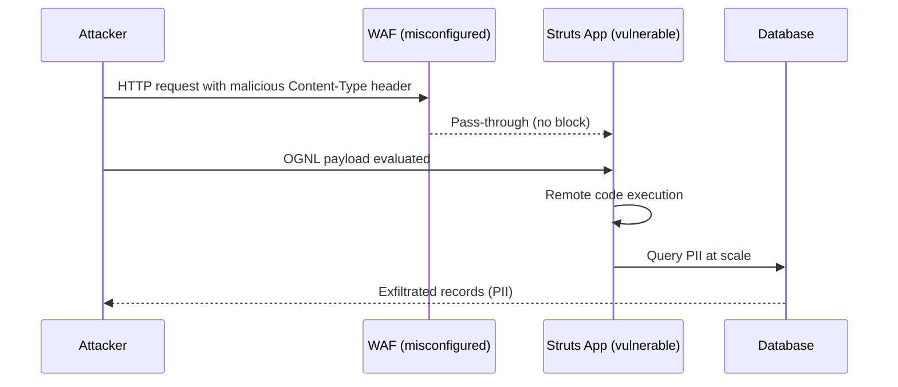

# Input validation and injection prevention with OpenAPI

---

## Key takeaways

APIs are designed to accept data as input. However, an API should never blindly trust the data it receives from a client. The process of rigorously checking all incoming data is called data validation.

**In this guide, you'll learn:**
- [How to implement schema-based validation](#schema-based-validation-as-security-contract) as a security contract
- [JSON Schema security constraints and validation patterns](#key-security-constraints)  
- [Attack prevention techniques](#attack-prevention-strategies) for SQL injection, OGNL injection, and mass assignment
- [Real-world lessons from the Equifax breach](#attack-example-equifax-ognl-injection-via-apache-struts-2017)
- [Automated validation governance and linting rules](#automated-governance-for-validation)
- [Input validation monitoring and troubleshooting](#input-validation-monitoring)

---

## Quick start guide

Ready to implement secure input validation? Follow these steps:

1. **Define validation rules:** Start with [schema-based validation](#schema-based-validation-as-security-contract) to create security contracts in your OpenAPI specifications
2. **Implement attack prevention:** Set up [SQL injection and mass assignment protection](#attack-prevention-strategies) using parameterized queries and `additionalProperties: false`
3. **Add governance rules:** Configure [automated governance](#automated-governance-for-validation) to prevent accidentally unvalidated endpoints
4. **Set up monitoring:** Implement [validation monitoring](#input-validation-monitoring) to detect attack attempts and track security metrics
5. **Handle edge cases:** Use [advanced validation techniques](#advanced-validation-techniques) for custom formats and contextual rules

**Next Steps:** Now that you have input validation covered, learn about [API Rate Limiting and Abuse Prevention](api-rate-limiting-abuse-prevention) to protect your APIs from denial-of-service attacks and business logic abuse.

---

## The restaurant waiter principle

> **The Restaurant Waiter**: The API is the waiter, and its documentation (or schema) is the menu. The menu explicitly states what can be ordered and in what format (e.g., "Steak - medium rare"). If a customer tries to order something not on the menu, like "a bicycle," or provides an invalid option, like "a million steaks," a competent waiter will immediately reject the order at the table before it ever reaches the kitchen. This is data validation.

## Technical implementation of data validation

In technical terms, data validation is the practice of checking all incoming data from a client to ensure it conforms to the expected format, type, range, and other constraints before it is processed by the application's business logic.

For example, if an API endpoint expects a user's age, validation rules should ensure the input is an integer and falls within a reasonable range (e.g., 0-130).

Proper data validation is a critical defense against a wide range of attacks, notably **Injection flaws**. An injection attack occurs when a malicious actor sends executable code disguised as data.

If the API fails to validate the input and passes it directly to a database or the operating system, that malicious code could be executed. By strictly validating that all inputs are what they are supposed to be, an API can reject malicious payloads before they can do any harm.

## Attack prevention strategies

Choose the appropriate prevention strategy based on the attack vector you're protecting against:


  

### SQL injection prevention

For interactions with a database, the gold standard for preventing SQL injection attacks is the use of parameterized queries, also known as prepared statements.

A parameterized query forces a separation between the SQL command (the code) and the user-supplied data, making it impossible for an attacker to alter the logic of the query.

**Before vs After: Preventing SQL Injection**

```javascript 
// Step 1: Receive user input from request (potentially malicious)
const userId = req.query.user_id;  // Could contain: "1; DROP TABLE users;--"

// VULNERABLE APPROACH - NEVER DO THIS  # [!code error]
// Problem: Direct string interpolation allows malicious code injection
const vulnerableQuery = `SELECT * FROM users WHERE id = ${userId}`;  // Creates: SELECT * FROM users WHERE id = 1; DROP TABLE users;--
// The database sees this as TWO commands: a SELECT and a DROP TABLE
const vulnerableResult = await db.query(vulnerableQuery);  // Executes both commands - deletes entire table!

// SECURE APPROACH - ALWAYS USE PARAMETERIZED QUERIES  # [!code highlight]
// Solution: SQL structure and data are separated at database level
const secureQuery = "SELECT * FROM users WHERE id = $1";  // SQL structure defined first
const secureResult = await db.query(secureQuery, [userId]);  // Data bound separately as parameter

// Why this works:  # [!code highlight]
// - Database parses SQL structure before receiving user data  # [!code highlight]
// - User input is treated as literal data, never as executable code  # [!code highlight]
// - Even "1; DROP TABLE users;--" becomes a harmless literal string value  # [!code highlight]

// Full Express.js route example:
app.get('/users/:id', async (req, res) => {
    try {
        const userId = req.params.id;
        const result = await db.query('SELECT * FROM users WHERE id = $1', [userId]);
        res.json(result.rows[0] || { error: 'User not found' });
    } catch (error) {
        console.error('Database error:', error);
        res.status(500).json({ error: 'Internal server error' });
    }
});
```

**How SQL injection prevention works:**
- **Parameterized queries**: The SQL structure is defined separately from user data
- **Data binding**: User input is bound to parameters after the SQL structure is parsed
- **No code injection**: Even malicious input like `1 OR 1=1; DROP TABLE users;` is treated as literal data
- **Database driver security**: Modern database drivers automatically escape parameter values




### Mass assignment attack prevention

Mass assignment attacks occur when an application accepts more input parameters than expected, allowing attackers to modify fields they shouldn't have access to. The `additionalProperties: false` constraint is essential for preventing these attacks.

**Mass Assignment Prevention: Before vs After**

```yaml 
NewUser:
  type: object
  # CRITICAL SECURITY SETTING: additionalProperties defaults to true - DANGEROUS!  # [!code error]
  # Without this setting, attackers can inject ANY extra fields into requests  # [!code highlight]
  additionalProperties: false  # [!code error] ESSENTIAL: Blocks mass assignment - REQUIRED for security
  
  # STEP 1: Define ONLY the fields that should be accepted  # [!code highlight]
  properties:
    name:
      type: string
      minLength: 1       # Prevent empty names
      maxLength: 100     # Prevent buffer overflow attacks
      pattern: "^[a-zA-Z\\s]+$"  # Allow only letters and spaces
    email:
      type: string
      format: email      # Built-in email validation prevents malformed input
      maxLength: 254     # Prevent resource exhaustion (RFC 5321 limit)
    
  # STEP 2: Require critical fields to prevent incomplete records  # [!code highlight]
  required:            # These fields MUST be provided
    - name            # User identification required
    - email           # Contact method required

# What this prevents:  # [!code highlight]
# Malicious request: {"name": "John", "email": "john@test.com", "isAdmin": true, "balance": 999999}  # [!code highlight]
# Result: isAdmin and balance fields are BLOCKED and ignored  # [!code highlight]
```

**How mass assignment prevention works:**
- **`additionalProperties: false`**: Rejects any properties not explicitly defined in the schema
- **Explicit allow-listing**: Only defined properties are accepted, unknown fields are blocked
- **Field-level validation**: Each allowed property has its own validation constraints
- **Attack surface reduction**: Prevents unauthorized modification of sensitive fields like `isAdmin`, `balance`, or `role`

**What this prevents**:
```json 
// This attack payload is blocked with additionalProperties: false
{
  "name": "John Doe",
  "email": "john@example.com",
  "isAdmin": true,        // [!code error] Blocked - not in schema
  "balance": 1000000      // [!code error] Blocked - not in schema  
}
```




## Schema-based validation as security contract

OpenAPI 3.1 provides a comprehensive vocabulary for defining strict validation rules by leveraging JSON Schema Draft 2020-12. By codifying these rules directly in your API specification, validation becomes core to your API's design.

**Secure API Schema with Input Validation**

```yaml 
components:
  schemas:
    NewUser:
      type: object
      # STEP 1: CRITICAL MASS ASSIGNMENT PROTECTION - blocks OWASP API3:2023  # [!code error]
      additionalProperties: false  # [!code error] ESSENTIAL: Prevents attackers from injecting extra fields
      
      # STEP 2: Define required fields to prevent incomplete records  # [!code highlight]
      required:
        - username      # User identification - mandatory
        - email        # Contact method - mandatory
        - password     # Authentication credential - mandatory
        - age          # Legal compliance (COPPA, etc.)
        
      properties:
        # STEP 3: Username validation - prevent enumeration and injection  # [!code highlight]
        username:
          type: string
          minLength: 4                   # Prevent too-short usernames (harder to guess)
          maxLength: 20                  # OWASP API4:2023: Prevent resource exhaustion
          pattern: "^[a-zA-Z0-9_-]+$"   # Allow-list only safe characters (blocks XSS, injection)
          description: "Alphanumeric characters, underscores, and hyphens only"
          example: "john_doe123"
          
        # STEP 4: Email validation - prevent malformed addresses and attacks  # [!code highlight]
        email:
          type: string
          minLength: 5                   # Shortest valid email: "a@b.c" 
          maxLength: 254                 # RFC 5321 limit - prevents buffer overflow
          format: email                  # Built-in validation (RFC 5322 format)
          description: "Must be a valid email address according to RFC 5322"
          example: "user@example.com"
          
        # STEP 5: Password constraints - security + usability balance  # [!code highlight]
        password:
          type: string
          minLength: 12                  # NIST recommends 12+ chars for user passwords
          maxLength: 128                 # Allow long passphrases but prevent DoS
          description: |
            Password requirements:
            - Minimum 12 characters (strong security baseline)
            - Maximum 128 characters (prevents resource exhaustion)
            - No composition requirements (per NIST 800-63B)
          example: "MySecurePassphrase123!"
          writeOnly: true                # [!code error] CRITICAL: NEVER return passwords in responses
          
        # STEP 6: Age validation - legal compliance and reasonableness checks  # [!code highlight]
        age:
          type: integer
          minimum: 13                    # COPPA compliance (US law for child privacy)
          maximum: 130                   # Prevent integer overflow attacks
          description: "User age in years (COPPA compliance requires 13+)"
          example: 25
          
        # STEP 7: Role-based access control with allow-list approach  # [!code highlight]
        role:
          type: string
          enum: ["user", "premium", "moderator"]  # [!code error] CRITICAL: Allow-list prevents privilege escalation
          default: "user"                # Secure default (least privilege)
          description: "User role determines access permissions"
          
        # STEP 8: Optional fields with validation (shows pattern for expansion)  # [!code highlight]
        profile:
          type: object
          additionalProperties: false    # [!code highlight] Nested objects also need mass assignment protection
          properties:
            firstName:
              type: string
              minLength: 1
              maxLength: 50              # Reasonable limits prevent storage abuse
              pattern: "^[\\p{L}\\s'-]+$"  # Unicode letters, spaces, hyphens, apostrophes
              description: "First name (supports international characters)"
            lastName:
              type: string  
              minLength: 1
              maxLength: 50
              pattern: "^[\\p{L}\\s'-]+$"
              description: "Last name (supports international characters)"
            bio:
              type: string
              maxLength: 500             # Prevent excessive text storage
              description: "User biography (plain text only)"
              
        # STEP 9: Contact preferences with validation  # [!code highlight]
        preferences:
          type: object
          additionalProperties: false    # [!code highlight] Every nested object needs this protection
          properties:
            newsletter:
              type: boolean
              default: false             # Privacy-friendly default (opt-in)
              description: "Subscribe to newsletter (GDPR compliant opt-in)"
            notifications:
              type: array
              maxItems: 10               # [!code error] CRITICAL: Prevent array abuse/DoS attacks
              uniqueItems: true          # No duplicate notification types
              items:
                type: string
                enum: ["email", "sms", "push", "in-app"]  # Allow-list notification channels
              description: "Preferred notification channels"

# STEP 10: Common validation patterns for reuse  # [!code highlight]
ValidationPattern:
  # Phone number with international support
  PhoneNumber:
    type: string
    pattern: "^\\+[1-9]\\d{1,14}$"      # [!code highlight] SECURITY: E.164 format prevents malformed numbers
    maxLength: 15                       # International standard maximum
    example: "+1234567890"
    
  # URL validation for security
  SecureUrl:
    type: string
    format: uri                         # Basic URI validation
    pattern: "^https://.*"              # [!code error] CRITICAL: FORCE HTTPS - no HTTP allowed
    maxLength: 2048                     # Prevent excessively long URLs
    example: "https://example.com"
```

**Key Security Controls**:
- **`additionalProperties: false`** blocks mass assignment attacks
- **Length constraints** prevent buffer overflow and resource exhaustion  
- **Pattern validation** blocks injection attempts and malformed data
- **Enum restrictions** enforce allow-lists instead of dangerous validation bypass

### Automated governance for validation

Modern API governance tools can enforce input validation rules that require string length bounds, numeric ranges, and prevent mass assignment vulnerabilities.

This governance approach transforms security reviews. Instead of manually checking many properties for missing `maxLength` constraints, automated linting tools handle baseline validation so security teams can focus on strategic concerns like business logic and context-dependent risks.

> **🚀 Interactive Implementation**: Learn to set up comprehensive input validation with our [Automated Security Validation Walkthrough](automated-security-validation-walkthrough), which includes production-ready rules for OWASP API Security Top 10 2023 compliance.

## Key security constraints

The most critical schema constraints for API security focus on preventing resource exhaustion and injection attacks:

- **`maxLength`**: Required on all strings to prevent memory exhaustion attacks
- **`maximum/minimum`**: Required on all numbers to prevent integer overflow vulnerabilities  
- **`additionalProperties: false`**: Essential for preventing mass assignment attacks
- **`pattern`**: Use restrictive regex patterns to block injection payloads

These constraints can be automatically enforced by governance rules, ensuring no schema can bypass these fundamental protections.

## Common validation patterns


* Input Type
* Validation Rules
* Example
---
* Email
* RFC 5322 format
* `user@example.com`
---
* Phone
* E.164 format
* `+1234567890`
---
* URL
* Valid URL scheme
* `https://example.com`
---
* UUID
* Standard UUID format
* `123e4567-e89b-12d3-a456-426614174000`
---
* Date
* ISO 8601 format
* `2025-01-20T10:30:00Z`
---
* Password
* Minimum complexity
* 8+ chars, mixed case, numbers, symbols


### Validation troubleshooting and common pitfalls

* Missing bounds (no `maxLength`, no numeric ranges) — leads to resource exhaustion
* Overly permissive regex patterns — allow unwanted characters and injection payloads
* Validating at the wrong layer — front-end only, or after DB calls
* Accepting undeclared properties — enables mass assignment

Quick fixes:

```yaml 
type: object
additionalProperties: false
properties:
  name:
    type: string
    minLength: 1
    maxLength: 100
    pattern: "^[a-zA-Z\\s]+$"
  age:
    type: integer
    minimum: 0
    maximum: 130
```

> API Security Best Practice: "Blocking PRs that add new string fields without `maxLength` constraints is one of the most cost-effective security guardrails you can implement."

## Attack example: Equifax (OGNL injection via Apache Struts, 2017)

The 2017 Equifax data breach was the result of a catastrophic input validation failure in the Apache Struts framework (CVE-2017-5638). The vulnerability allowed attackers to perform remote code execution by sending a specially crafted `Content-Type` header. The Struts framework failed to properly sanitize this header value, interpreting it as an Object-Graph Navigation Language (OGNL) expression and executing it. This gave attackers a direct shell on the server, which they used to access sensitive databases and exfiltrate the personal data of over 140 million people.

This incident underscores the critical importance of validating all inputs, including HTTP headers, against a strict allow-list or pattern. A strong schema-based validation approach, enforced by governance, can block entire classes of injection attacks before they ever reach vulnerable application code.



*Sequence diagram illustrating the Equifax breach: attacker exploited Apache Struts vulnerability through OGNL injection in Content-Type headers, bypassing WAF and executing code to steal personal data.*

Why this matters: Strong schema validation, input allow-lists, and patch hygiene block entire classes of injection attacks.

**Security operations:** When schema validation and [attack prevention strategies](#attack-prevention-strategies) are in place, implement [monitoring](#input-validation-monitoring) to detect attempted breaches and [advanced validation techniques](#advanced-validation-techniques) for complex scenarios.

## Input validation monitoring

Choose your monitoring approach based on your security operations needs:


  

### Validation failure logging

**Express.js Middleware for Security Monitoring**

```javascript 
// Middleware to log validation failures for security analysis
app.use((req, res, next) => {
  const originalSend = res.send;
  
  res.send = function(data) {
    // Track validation failures for potential attack patterns
    if (res.statusCode === 400 && req.validationErrors) {  // [!code highlight]
      logger.warn('Validation failure', {  // [!code highlight]
        endpoint: req.path,                // [!code highlight] Track which endpoints are targeted
        errors: req.validationErrors,      // [!code highlight] Log specific validation failures
        clientIP: req.ip,                  // [!code highlight] Track source IPs for analysis
        userAgent: req.get('User-Agent')   // [!code highlight] Detect automated attacks
      });
    }
    
    originalSend.call(this, data);
  };
  
  next();
});
```

**How validation logging works:**
- **Middleware interception**: Captures all responses before they're sent to clients
- **Status code filtering**: Only logs when `statusCode === 400` (validation failures)
- **Structured logging**: Records endpoint, errors, IP, and user agent for security analysis
- **Attack pattern detection**: Unusual spikes or repeated failures from same IPs indicate potential attacks

**Why this matters**: Logging validation failures helps detect attack patterns, frequent probe attempts, and potential security issues before they escalate. Monitor these logs for unusual spikes or repeated failures from the same IP addresses.




### Validation metrics

```javascript
// Track validation patterns for security analysis
class ValidationMetrics {
    constructor() {
        this.validationFailures = new Map();       // [!code highlight] Count failures by type
        this.attackPatterns = new Map();           // [!code highlight] Track potential attacks
    }
    
    recordFailure(endpoint, field, errorType) {
        const key = `${endpoint}:${field}:${errorType}`;
        
        // Initialize counter if key doesn't exist
        if (!this.validationFailures.has(key)) {
            this.validationFailures.set(key, 0);
        }
        this.validationFailures.set(key, this.validationFailures.get(key) + 1);  // [!code highlight] Increment failure counter
        
        // Detect potential attack patterns                                        // [!code highlight]
        const attackTypes = ['pattern_violation', 'length_exceeded', 'additional_property'];
        if (attackTypes.includes(errorType)) {
            if (!this.attackPatterns.has(endpoint)) {
                this.attackPatterns.set(endpoint, 0);
            }
            this.attackPatterns.set(endpoint, this.attackPatterns.get(endpoint) + 1);  // [!code highlight] Flag suspicious activity
        }
    }
    
    getAttackSummary() {
        return Object.fromEntries(this.attackPatterns);                // [!code highlight] Return attack metrics
    }
    
    // Additional utility method for comprehensive metrics
    getFailureReport() {
        return {
            totalFailures: this.validationFailures.size,
            attackPatterns: this.getAttackSummary(),
            topFailureTypes: Object.fromEntries(this.validationFailures)
        };
    }
}

// Usage in Express.js validation middleware
const validationMetrics = new ValidationMetrics();

function trackValidationError(req, field, errorType) {
    const endpoint = req.route?.path || req.path;
    validationMetrics.recordFailure(endpoint, field, errorType);
    
    // Log for immediate monitoring
    console.warn('Validation failure tracked', {
        endpoint,
        field,
        errorType,
        ip: req.ip,
        userAgent: req.get('User-Agent')
    });
}
```

**How validation metrics work:**
- **Failure tracking**: Counts validation failures by endpoint, field, and error type
- **Pattern detection**: Identifies suspicious error types that often indicate attacks
- **Attack scoring**: Tracks which endpoints receive the most attack attempts
- **Metrics export**: Provides data for security dashboards and alerting systems

**Key metrics to monitor:**
- **`pattern_violation`**: Input doesn't match expected format (possible injection attempt)
- **`length_exceeded`**: Input too long (buffer overflow or DoS attempt)
- **`additional_property`**: Extra fields in request (mass assignment attack)




## Advanced validation techniques

### Custom format validators
```javascript
// Custom OpenAPI format validators
const customFormats = {
  'safe-html': {
    validate: (value) => {
      // Strip dangerous HTML tags and attributes
      const clean = DOMPurify.sanitize(value, {
        ALLOWED_TAGS: ['p', 'br', 'strong', 'em'],
        ALLOWED_ATTR: []
      });
      return clean === value;
    }
  },
  'sql-safe': {
    validate: (value) => {
      // Block SQL injection patterns
      const sqlPatterns = /('|(\\x27)|(\\x2D\\x2D)|(%27)|(%2D%2D))/i;
      return !sqlPatterns.test(value);
    }
  }
};

// Use in OpenAPI schema
const schema = {
  type: "string",
  format: "safe-html",
  maxLength: 1000
};
```

### Contextual validation rules
```yaml 
# Different validation rules based on context
components:
  schemas:
    PublicProfile:
      type: object
      additionalProperties: false
      properties:
        displayName:
          type: string
          maxLength: 50
          pattern: "^[a-zA-Z0-9\\s._-]+$"  # More restrictive for public display
    
    InternalUser:
      type: object
      additionalProperties: false
      properties:
        displayName:
          type: string
          maxLength: 100
          pattern: "^[\\w\\s._@-]+$"      # Less restrictive for internal use
```

## Frequently asked questions

### How does OpenAPI validation prevent injection attacks?
OpenAPI specifications define precise data schemas with type validation, format constraints, and length limits. When enforced by [automated governance](#automated-governance-for-validation), these schemas automatically reject malformed inputs that could contain injection payloads, stopping attacks before they reach your application logic. See [Schema-Based Validation as Security Contract](#schema-based-validation-as-security-contract) for implementation details.

### What's the difference between client-side and server-side validation?
Client-side validation improves user experience by providing immediate feedback, but it can be bypassed by attackers. Server-side validation is the critical security control—never trust data from the client. Always validate on the server even if you also validate on the client. Review our [attack prevention strategies](#attack-prevention-strategies) to understand why server-side validation is essential.

### Should I validate HTTP headers and query parameters?
Yes! The [Equifax breach](#attack-example-equifax-ognl-injection-via-apache-struts-2017) occurred through a malicious `Content-Type` header. All inputs—including headers, query parameters, path parameters, and request bodies—should be validated against strict schemas. Don't assume any input is safe.

### How do I handle file uploads securely?
File uploads require special attention: validate file types using content inspection (not just extensions), enforce size limits, scan for malware, store files outside the web root, and use content-disposition headers to prevent execution. Consider using dedicated file storage services with [advanced validation techniques](#advanced-validation-techniques).

### What's the performance impact of extensive validation?
Modern validation libraries are highly optimized. The security benefit far outweighs the minimal performance cost. Consider caching compiled schemas and using efficient validation libraries like `ajv` for JavaScript or `jsonschema` for Python. Implement [validation monitoring](#input-validation-monitoring) to track performance impacts.

## Resources and next steps

### Essential Reading
- [OWASP API Security Top 10](https://owasp.org/www-project-api-security/) - Comprehensive vulnerability guide including injection attacks (API3:2023) and resource consumption (API4:2023)
- [JSON Schema Specification](https://json-schema.org/specification.html) - Complete reference for OpenAPI validation capabilities
- [OpenAPI Data Types](https://spec.openapis.org/oas/v3.1.0#data-types) - Official OpenAPI data type and format specifications

### Implementation Tools  
- [AJV JSON Schema Validator](https://ajv.js.org/) - Fast JSON Schema validation for JavaScript/Node.js
- [Joi Validation](https://joi.dev/) - Object schema validation library with expressive API
- [Cerberus](https://docs.python-cerberus.org/) - Lightweight, extensible data validation library for Python

### Security Testing Tools
- [OWASP ZAP](https://owasp.org/www-project-zap/) - Security testing proxy for finding injection vulnerabilities
- [Postman Security Testing](https://learning.postman.com/docs/writing-scripts/test-scripts/) - API security test automation
- [Burp Suite](https://portswigger.net/burp) - Web application security testing platform

### Related Security Topics
- [API TLS Encryption and HTTPS Best Practices](api-tls-encryption-https-best-practices) - Secure data in transit
- [API Rate Limiting and Abuse Prevention](api-rate-limiting-abuse-prevention) - Prevent DoS attacks and abuse
- [Authentication and Authorization with OpenAPI](authentication-authorization-openapi) - Implement secure access control
- [API Security by Design: Complete Guide](/learn/security) - Overview of all API security domains