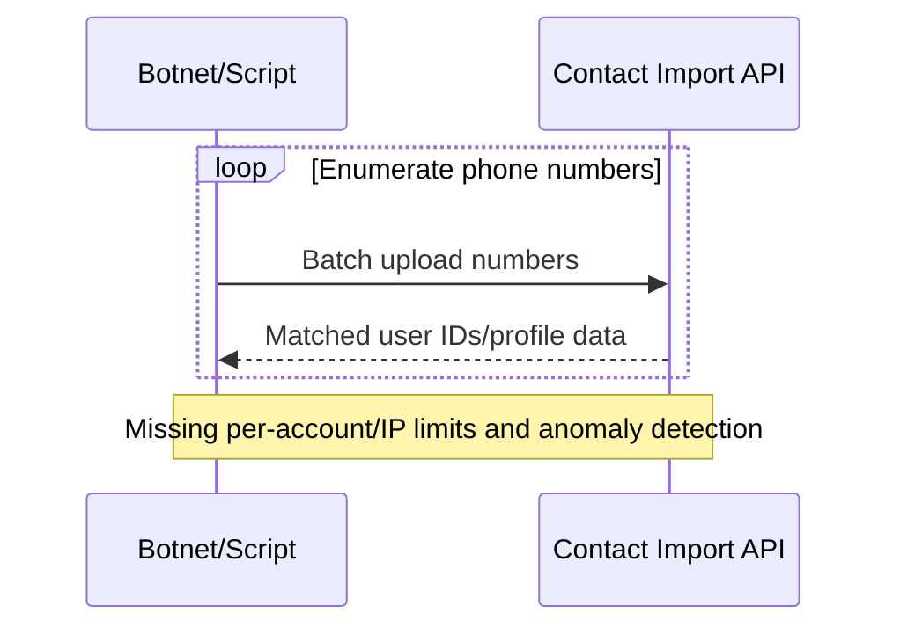

# Rate Limiting and Abuse Prevention for APIs

---

## Key Takeaways

A single client, whether intentionally malicious or simply due to a bug in its code, can send a massive number of requests to an API in a short period. This can overwhelm the server, degrading performance for all other users or even causing the service to crash. Rate limiting is the primary defense against this scenario.

**In this guide, you'll learn:**
- How to implement rate limiting as a security and reliability control
- OpenAPI x-rateLimit extensions and documentation strategies
- Rate limiting algorithms and multi-tier implementation patterns
- Client-side exponential backoff and error handling
- Real-world lessons from the Facebook phone number scraping incident
- Advanced rate limiting techniques and monitoring approaches

---

## The Library Card Principle

> **The Library Card**: A library card allows a patron to check out a maximum of ten books per month. Once that limit is reached, the system will not allow any more checkouts until the next month begins, regardless of how many times the patron asks.

**Rate limiting** applies this same principle to an API. It establishes a policy that restricts the number of requests a single client can make within a specific time window (e.g., 100 requests per minute).

## Why Rate Limiting Is Critical for API Security

Rate limiting is a critical control for both security and reliability, directly mitigating several OWASP API Security Top 10 risks:

1. **Security:** It thwarts Denial-of-Service (DoS) attacks by preventing traffic floods, addressing OWASP API4:2023 - Unrestricted Resource Consumption. It also makes brute-force attacks against [authentication endpoints](authentication-authorization-openapi) much slower and less effective, reducing the risk of credential stuffing attacks.

2. **Business Logic Abuse:** It helps mitigate abuse by preventing bots from scraping data or manipulating business flows, addressing OWASP API6:2023 - Unrestricted Access to Sensitive Business Flows.

3. **Reliability and Fair Usage:** It ensures that the API remains stable and responsive for all users by preventing any single client from monopolizing server resources.

## Documenting Rate Limits in OpenAPI

While OpenAPI 3.1 doesn't include native rate-limiting objects, extension properties (prefixed with `x-`) provide a standard mechanism. The best practice is defining custom `x-rateLimit` extensions at the operation level.

**Note:** Rate limits are typically dynamic in production environments, with different limits for different clients based on service tiers, contracts, or usage patterns. The OpenAPI specification documents the baseline policy, while implementation systems apply client-specific variations.

```yaml 
paths:
  /auth/login:
    post:
      summary: User Login
      tags: [Authentication]
      # Define rate-limiting policy for this sensitive endpoint
      x-rateLimit:
        limit: 5
        window: "1m"
        scope: "ip_address"
        description: "Limits login attempts to 5 per minute per IP to prevent brute-force attacks."
      responses:
        '200':
          description: "Successful login."
        # Document the 429 response with proper headers
        '429':
          description: "Too Many Requests. Rate limit exceeded."
          headers:
            Retry-After:
              schema:
                type: integer
              description: "Seconds to wait before making a new request."
            X-RateLimit-Limit:
              schema:
                type: integer
              description: "Maximum requests permitted in the window."
            X-RateLimit-Remaining:
              schema:
                type: integer
              description: "Requests remaining in current window."
```

### Automated Governance for Rate Limiting

API governance tools can enforce rules that ensure [authentication endpoints](authentication-authorization-openapi) always have rate limiting policies defined.

This approach provides dual benefits: modern API documentation tools automatically display rate limiting extensions in generated documentation, making policies transparent to API consumers, while governance rules ensure sensitive endpoints never lack rate-limiting policies.

> **🔧 Implementation Guide**: See our [Automated Security Validation Walkthrough](automated-security-validation-walkthrough) for step-by-step instructions on implementing rate limiting validation rules, including 429 response validation and header consistency checks.

## Rate Limiting Implementation Approaches

### Common Algorithm Types

**Token Bucket**: Allows burst traffic within limits, refills at steady rate
- Best for: APIs that need to handle legitimate traffic spikes
- Pros: Flexible, allows bursts, smooth long-term rate limiting
- Cons: More complex to implement, requires state management

**Sliding Window**: Precise per-window enforcement with distributed request tracking
- Best for: APIs requiring exact rate limiting precision
- Pros: Most accurate, prevents boundary condition abuse
- Cons: Memory intensive, complex distributed implementation

**Fixed Window**: Simple per-timeframe limits, prone to boundary conditions
- Best for: Simple use cases, easy implementation
- Pros: Simple to implement and understand
- Cons: Allows traffic spikes at window boundaries

### Multi-tier Strategy Example

```yaml 
rate_limits:
  global:
    requests_per_minute: 1000
    requests_per_hour: 10000
  by_endpoint:
    "/auth/*":
      requests_per_minute: 5
      requests_per_hour: 20
    "/api/data":
      requests_per_minute: 100
      requests_per_hour: 2000
    "/api/search":
      requests_per_minute: 50
      requests_per_hour: 1000
```

## Advanced Rate Limiting Techniques

### Multi-tier Rate Limiting Configuration

```yaml 
plugins:
- name: rate-limiting
  config:
    minute: 100        # 100 requests per minute per IP
    hour: 1000         # 1000 requests per hour per IP
    policy: redis      # Use Redis for distributed rate limiting
    fault_tolerant: true
    hide_client_headers: false

# Per-endpoint overrides
- name: rate-limiting
  route: auth-endpoints
  config:
    minute: 5          # Stricter limits for auth endpoints
    hour: 20
    policy: redis
```

### Client-side Exponential Backoff

```javascript
class APIClient {
  async makeRequest(url, options, retries = 3) {
    try {
      const response = await fetch(url, options);
      
      if (response.status === 429) {
        const retryAfter = response.headers.get('Retry-After');
        const delay = retryAfter ? parseInt(retryAfter) * 1000 : 
                     Math.pow(2, 4 - retries) * 1000; // Exponential backoff
        
        if (retries > 0) {
          await new Promise(resolve => setTimeout(resolve, delay));
          return this.makeRequest(url, options, retries - 1);
        }
        
        throw new Error('Rate limit exceeded');
      }
      
      return response;
    } catch (error) {
      throw error;
    }
  }
}
```

As a complementary practice, the client-side responsibility of implementing exponential backoff should also be noted. When an API client receives a rate-limiting error (e.g., HTTP 429 Too Many Requests), it should wait for an exponentially increasing period of time between retries. This prevents clients from overwhelming the server and helps the system recover gracefully from load spikes.

> **Tip:** Combine per-IP and per-account quotas and require exponential backoff on clients.

## Attack Example: Facebook Phone Number Scraping (2019)

In 2019, malicious actors exploited a vulnerability in Facebook's contact importer feature to scrape the personal data of over 530 million users. The API endpoint itself was not technically "broken"—it performed its intended function of matching phone numbers to user profiles. The vulnerability was the absence of adequate rate limiting and business rule enforcement.

Attackers used automated scripts to submit massive lists of phone numbers, and the API dutifully returned the corresponding user profiles, allowing them to build a massive database of personal information.

This incident highlights a different type of API attack, moving from exploiting technical flaws to abusing business logic at scale. It elevates rate limiting from an infrastructure protection mechanism to also being a tool for enforcing business rules. The `x-rateLimit` extension in OpenAPI is a form of declarative security policy.



*Sequence diagram showing how attackers used Facebook's contact import API to scrape phone numbers at scale, exploiting missing rate limits and velocity checks to harvest personal data.*

Why this matters: Rate limiting, velocity checks, and behavior analytics are core defenses against scraping and credential-stuffing at scale.

## Rate Limiting Monitoring and Observability

### Rate Limiting Metrics Collection

```python
# Track rate limiting metrics for security analysis
import time
from collections import defaultdict

class RateLimitMetrics:
    def __init__(self):
        self.blocked_requests = defaultdict(int)
        self.total_requests = defaultdict(int)
        self.suspicious_patterns = defaultdict(list)
    
    def record_request(self, client_id, blocked=False, endpoint=None):
        self.total_requests[client_id] += 1
        if blocked:
            self.blocked_requests[client_id] += 1
            # Track suspicious patterns
            self.suspicious_patterns[client_id].append({
                'timestamp': time.time(),
                'endpoint': endpoint,
                'blocked': True
            })
    
    def get_block_rate(self, client_id):
        total = self.total_requests[client_id]
        blocked = self.blocked_requests[client_id]
        return (blocked / total) * 100 if total > 0 else 0
    
    def get_attack_indicators(self, client_id, window_minutes=5):
        """Detect rapid repeated attempts that might indicate an attack"""
        recent_blocks = [
            event for event in self.suspicious_patterns[client_id]
            if time.time() - event['timestamp'] < window_minutes * 60
        ]
        return len(recent_blocks)
```

### Alerting Configuration

```yaml 
groups:
- name: rate_limiting_alerts
  rules:
  - alert: HighRateLimitBlocks
    expr: rate(rate_limit_blocked_total[5m]) > 10
    for: 2m
    labels:
      severity: warning
    annotations:
      summary: "High rate of blocked requests detected"
      description: "{{ $value }} requests per second being blocked"

  - alert: SuspiciousRateLimitPattern
    expr: rate_limit_block_rate > 80
    for: 1m
    labels:
      severity: critical
    annotations:
      summary: "Possible DDoS or brute force attack"
      description: "Client {{ $labels.client_id }} has {{ $value }}% blocked rate"
```

### Rate Limiting Troubleshooting

**Common Issues and Solutions:**

* **Counting the wrong thing** — per-IP only; add per-account and per-token limits
* **Same limits for every endpoint** — tighten auth and write endpoints separately  
* **No Retry-After header** — clients can't back off predictably
* **Stateless limits in distributed systems** — use Redis or gateway-native stores
* **Legitimate bursts blocked** — implement token bucket algorithm for flexibility

**Quick Diagnostic Commands:**

```bash
# Observe 429 behavior and headers
curl -i https://api.example.com/login | grep -E 'HTTP/|Retry-After|X-RateLimit'

# Simulate burst to verify rate limiting
hey -z 10s -q 50 -c 50 https://api.example.com/api/resource

# Test different client patterns
for i in {1..10}; do
  curl -H "Authorization: Bearer $TOKEN" https://api.example.com/api/data
  sleep 1
done
```

### Advanced Rate Limiting Patterns

**Adaptive Rate Limiting:**
```javascript
// Adjust limits based on server health
class AdaptiveRateLimit {
  constructor() {
    this.baseLimit = 100;
    this.currentLimit = 100;
    this.healthThreshold = 0.8;
  }
  
  adjustLimit(serverLoad, errorRate) {
    if (serverLoad > this.healthThreshold || errorRate > 0.1) {
      this.currentLimit = Math.max(10, this.currentLimit * 0.8);
    } else if (serverLoad < 0.5 && errorRate < 0.01) {
      this.currentLimit = Math.min(this.baseLimit, this.currentLimit * 1.1);
    }
  }
}
```

**Geographic Rate Limiting:**
```yaml 
# Different limits based on geographic regions
geo $rate_limit_zone {
    default $binary_remote_addr;
    # More restrictive limits for high-risk regions
    ~^192\.168\. $binary_remote_addr_strict;
    ~^10\. $binary_remote_addr_internal;
}

limit_req_zone $rate_limit_zone zone=general:10m rate=100r/m;
limit_req_zone $binary_remote_addr_strict zone=restricted:10m rate=20r/m;
limit_req_zone $binary_remote_addr_internal zone=internal:10m rate=1000r/m;
```

> Rate Limiting Best Practice: "Rate limiting on auth endpoints is non-negotiable. We set 5/min per IP and per account, and alert when bypass attempts appear."

## Frequently Asked Questions

### Why is rate limiting important for API security?
Rate limiting prevents denial-of-service attacks, brute-force authentication attempts, and data scraping. It ensures fair resource usage among legitimate users while blocking malicious automation. Without rate limits, a single bad actor can overwhelm your API infrastructure.

### What's the difference between rate limiting and throttling?
Rate limiting sets hard limits on request volume (e.g., 100 requests per minute), rejecting excess requests with 429 status codes. Throttling typically involves slowing down or queuing requests rather than rejecting them outright. Rate limiting is more common for APIs as it provides clearer client feedback.

### Should rate limits be per-IP, per-user, or both?
Implement multiple layers: per-IP limits prevent DDoS attacks from single sources, per-user limits enforce fair usage policies, and per-API-key limits support tiered service levels. Combine all three for comprehensive protection against different attack patterns.

### How do I handle legitimate traffic spikes?
Use token bucket algorithms that allow controlled bursts within overall rate limits. Consider implementing adaptive rate limiting that adjusts limits based on server health. For predictable spikes, provide rate limit increase APIs or temporary exemption mechanisms for verified clients.

### What rate limiting algorithm should I choose?
- **Token Bucket**: Best for APIs needing burst flexibility
- **Sliding Window**: Most accurate but memory intensive  
- **Fixed Window**: Simple but allows boundary condition abuse
- **Sliding Window Log**: Precise but computationally expensive

Choose based on your accuracy requirements, traffic patterns, and implementation complexity tolerance.

### How do I communicate rate limits to API consumers?
Document limits in OpenAPI specifications using `x-rateLimit` extensions, include rate limit headers in responses (`X-RateLimit-Limit`, `X-RateLimit-Remaining`, `Retry-After`), provide clear error messages with 429 responses, and maintain public documentation about your rate limiting policies.

## Rate Limiting Strategy Framework

### Implementation Priority

1. **Critical Endpoints First**
   - Authentication endpoints: 5-10 requests per minute per IP
   - Password reset: 3 requests per hour per email
   - Account creation: 5 requests per hour per IP
   - Payment processing: Strict limits based on business rules

2. **Resource-Intensive Operations**  
   - Search endpoints: Higher limits but monitor query complexity
   - File uploads: Size-based and frequency-based limits
   - Data export: Very restrictive limits with queuing

3. **General API Access**
   - Read operations: Generous limits for good user experience
   - Write operations: More restrictive than reads
   - Administrative endpoints: Very restrictive with strong authentication

### Rate Limit Testing Strategy

```python
# Rate limit testing framework
import asyncio
import aiohttp
import time

async def test_rate_limit(url, requests_count, window_seconds):
    """Test rate limiting behavior"""
    start_time = time.time()
    successful_requests = 0
    blocked_requests = 0
    
    async with aiohttp.ClientSession() as session:
        tasks = []
        for i in range(requests_count):
            tasks.append(make_request(session, url))
        
        responses = await asyncio.gather(*tasks, return_exceptions=True)
        
        for response in responses:
            if isinstance(response, Exception):
                continue
            if response.status == 200:
                successful_requests += 1
            elif response.status == 429:
                blocked_requests += 1
    
    elapsed = time.time() - start_time
    print(f"Rate limit test results:")
    print(f"Successful: {successful_requests}, Blocked: {blocked_requests}")
    print(f"Effective rate: {successful_requests/elapsed:.2f} req/sec")

async def make_request(session, url):
    try:
        async with session.get(url) as response:
            return response
    except Exception as e:
        return e
```

## Resources and Next Steps

### Essential Reading
- [OWASP API Security Top 10](https://owasp.org/www-project-api-security/) - Comprehensive guide including unrestricted resource consumption (API4:2023) and business logic abuse (API6:2023)
- [RFC 6585](https://tools.ietf.org/html/rfc6585) - HTTP status code 429 (Too Many Requests) specification
- [Rate Limiting Algorithms](https://en.wikipedia.org/wiki/Rate_limiting) - Technical overview of different rate limiting approaches

### Implementation Tools  
- [Redis](https://redis.io/) - In-memory data store commonly used for distributed rate limiting
- [Kong Rate Limiting Plugin](https://docs.konghq.com/hub/kong-inc/rate-limiting/) - Enterprise-grade API gateway rate limiting
- [nginx limit_req_zone](https://nginx.org/en/docs/http/ngx_http_limit_req_module.html) - High-performance rate limiting at the reverse proxy level

### Monitoring and Analytics
- [Prometheus](https://prometheus.io/) - Metrics collection and alerting for rate limiting monitoring  
- [Grafana](https://grafana.com/) - Visualization dashboards for rate limiting metrics
- [Elastic Stack](https://www.elastic.co/elastic-stack/) - Log analysis and pattern detection for abuse identification

### Load Testing Tools
- [hey](https://github.com/rakyll/hey) - Simple load testing tool for rate limit verification
- [Apache Bench (ab)](https://httpd.apache.org/docs/2.4/programs/ab.html) - Basic HTTP server benchmarking
- [JMeter](https://jmeter.apache.org/) - Comprehensive performance testing with rate limiting scenarios

### Related Security Topics
- [API Input Validation and Injection Prevention](api-input-validation-injection-prevention) - Protect APIs from malicious data
- [Authentication and Authorization with OpenAPI](authentication-authorization-openapi) - Implement secure access control  
- [API TLS Encryption and HTTPS Best Practices](api-tls-encryption-https-best-practices) - Secure data in transit
- [API Security by Design: Complete Guide](/learn/security) - Overview of all API security domains

---

**Next Steps:** Now that you have rate limiting protection in place, learn about [Authentication and Authorization with OpenAPI](authentication-authorization-openapi) to implement comprehensive access control for your APIs.