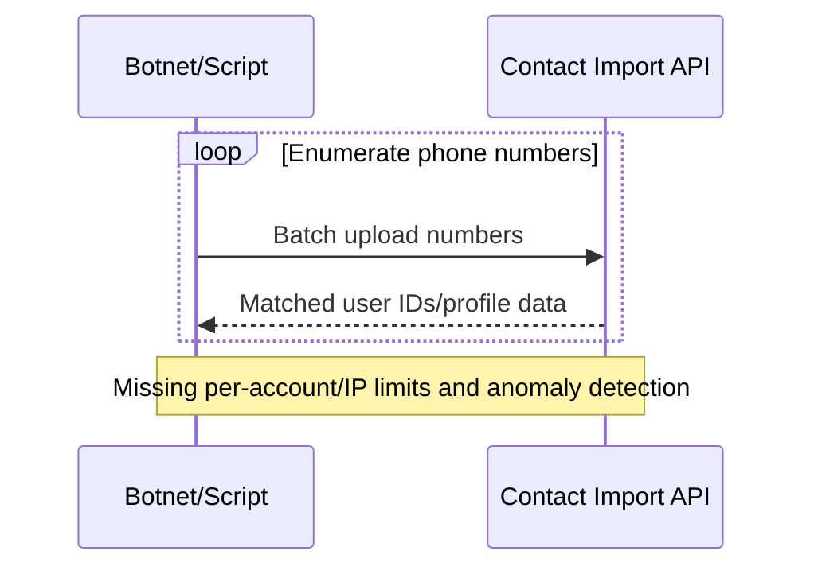

# Rate Limiting and Abuse Prevention for APIs

---

## Key takeaways

A single client, whether intentionally malicious or simply due to a bug in its code, can send a massive number of requests to an API in a short period. This can overwhelm the server, degrading performance for all other users or even causing the service to crash. Rate limiting is the primary defense against this scenario.

**In this guide, you'll learn:**
- [How to implement rate limiting](#documenting-rate-limits-in-openapi) as a security and reliability control
- [OpenAPI x-rateLimit extensions](#documenting-rate-limits-in-openapi) and documentation strategies
- [Rate limiting algorithms and implementation patterns](#rate-limiting-implementation-approaches)
- [Client-side exponential backoff](#client-side-exponential-backoff) and error handling
- [Real-world lessons from the Facebook phone number scraping incident](#attack-example-facebook-phone-number-scraping-2019)
- [Advanced techniques and monitoring approaches](#rate-limiting-monitoring-and-observability)

---

## Quick start guide

Ready to implement effective rate limiting? Follow these steps:

1. **Document rate limits:** Add [OpenAPI x-rateLimit extensions](#documenting-rate-limits-in-openapi) to your API specifications
2. **Choose an algorithm:** Select from [Token Bucket, Sliding Window, or Fixed Window](#rate-limiting-implementation-approaches) based on your needs
3. **Implement multi-tier limits:** Set up global, per-endpoint, and per-client [rate limiting configurations](#advanced-rate-limiting-techniques)  
4. **Set up monitoring:** Implement [metrics collection and alerting](#rate-limiting-monitoring-and-observability) to detect attacks
5. **Test and tune:** Use the [implementation strategy framework](#rate-limiting-strategy-framework) to prioritize critical endpoints and validate limits

**Next Steps:** Now that you have rate limiting protection in place, learn about [Authentication and Authorization with OpenAPI](authentication-authorization-openapi) to implement comprehensive access control for your APIs.

---

## The library card principle

> **The Library Card**: A library card allows a patron to check out a maximum of ten books per month. Once that limit is reached, the system will not allow any more checkouts until the next month begins, regardless of how many times the patron asks.

**Rate limiting** applies this same principle to an API. It establishes a policy that restricts the number of requests a single client can make within a specific time window (e.g., 100 requests per minute).

## Why rate limiting is critical for API security

Rate limiting is a critical control for both security and reliability, directly mitigating several OWASP API Security Top 10 risks:

1. **Security:** It thwarts Denial-of-Service (DoS) attacks by preventing traffic floods, addressing OWASP API4:2023 - Unrestricted Resource Consumption. It also makes brute-force attacks against [authentication endpoints](authentication-authorization-openapi) much slower and less effective, reducing the risk of credential stuffing attacks.

2. **Business Logic Abuse:** It helps mitigate abuse by preventing bots from scraping data or manipulating business flows, addressing OWASP API6:2023 - Unrestricted Access to Sensitive Business Flows.

3. **Reliability and Fair Usage:** It ensures that the API remains stable and responsive for all users by preventing any single client from monopolizing server resources.

## Documenting rate limits in OpenAPI

While OpenAPI 3.1 doesn't include native rate-limiting objects, extension properties (prefixed with `x-`) provide a standard mechanism. The best practice is defining custom `x-rateLimit` extensions at the operation level.

**Note:** Rate limits are typically dynamic in production environments, with different limits for different clients based on service tiers, contracts, or usage patterns. The OpenAPI specification documents the baseline policy, while implementation systems apply client-specific variations.

```yaml 
paths:
  /auth/login:
    post:
      summary: User Login
      tags: [Authentication]
      # Define rate-limiting policy for this sensitive endpoint  # [!code highlight]
      x-rateLimit:
        limit: 5                  # [!code highlight] Strict limit for auth endpoints
        window: "1m"              # [!code highlight] Short time window
        scope: "ip_address"       # [!code highlight] IP-based rate limiting
        description: "Limits login attempts to 5 per minute per IP to prevent brute-force attacks."
      responses:
        '200':
          description: "Successful login."
        # Document the 429 response with proper headers  # [!code highlight]
        '429':
          description: "Too Many Requests. Rate limit exceeded."
          headers:
            Retry-After:              # [!code highlight] Required for proper client behavior
              schema:
                type: integer
              description: "Seconds to wait before making a new request."
            X-RateLimit-Limit:       # [!code highlight] Inform clients of limits
              schema:
                type: integer
              description: "Maximum requests permitted in the window."
            X-RateLimit-Remaining:   # [!code highlight] Help clients pace requests
              schema:
                type: integer
              description: "Requests remaining in current window."
```

### Automated governance for rate limiting

API governance tools can enforce rules that ensure [authentication endpoints](authentication-authorization-openapi) always have rate limiting policies defined.

This approach provides dual benefits: modern API documentation tools automatically display rate limiting extensions in generated documentation, making policies transparent to API consumers, while governance rules ensure sensitive endpoints never lack rate-limiting policies.

> **🔧 Implementation Guide**: See our [Automated Security Validation Walkthrough](automated-security-validation-walkthrough) for step-by-step instructions on implementing rate limiting validation rules, including 429 response validation and header consistency checks.

## Rate limiting implementation approaches

Choose the rate limiting algorithm that best fits your traffic patterns and precision requirements:


  

### Token bucket algorithm

**Best for:** APIs that need to handle legitimate traffic spikes

**How it works:**
- Tokens are added to a bucket at a steady rate (refill rate)
- Each request consumes one token from the bucket
- If bucket is empty, requests are rejected or queued
- Allows burst traffic up to bucket capacity

**Pros:**
- **Flexible burst handling**: Accommodates legitimate traffic spikes
- **Smooth long-term limiting**: Maintains steady average rate
- **User-friendly**: Doesn't penalize users for occasional bursts

**Cons:**
- **Implementation complexity**: Requires token state management
- **Memory overhead**: Need to track bucket state per client
- **Distributed challenges**: Synchronizing token state across servers

**Implementation example:**
```javascript 
class TokenBucket {
  constructor(capacity, refillRate) {
    // STEP 1: Initialize bucket parameters
    this.capacity = capacity;           // Max burst size (e.g., 100 requests)
    this.tokens = capacity;             // Start with full bucket (allows immediate bursts)
    this.refillRate = refillRate;       // Steady rate (e.g., 10 requests/second)
    this.lastRefill = Date.now();       // Track when we last added tokens
  }

  // STEP 2: Process incoming request - the main security enforcement point
  consume(tokens = 1) {
    // First, add any tokens we've earned since last request
    this.refill();                      // CRITICAL: Always refill before checking
    
    // STEP 3: Security decision - allow or block the request
    if (this.tokens >= tokens) {
      this.tokens -= tokens;            // Consume tokens for this request
      return true;                      // ✅ REQUEST ALLOWED - user under limit
    }
    
    // STEP 4: Rate limit exceeded - implement security response
    console.warn(`Rate limit exceeded. Tokens available: ${this.tokens}, requested: ${tokens}`);
    return false;                       // ❌ BLOCK REQUEST - user over limit
  }

  // STEP 5: Token refill logic - implements the "steady rate" behavior
  refill() {
    const now = Date.now();
    const timePassed = (now - this.lastRefill) / 1000;  // Convert to seconds
    
    // Calculate tokens earned: time × rate
    const tokensToAdd = Math.floor(timePassed * this.refillRate);  // Floor prevents fractional tokens
    
    if (tokensToAdd > 0) {
      // Add tokens but never exceed capacity (prevents bucket overflow)
      this.tokens = Math.min(this.capacity, this.tokens + tokensToAdd);
      this.lastRefill = now;            // Update timestamp for next calculation
      
      console.debug(`Added ${tokensToAdd} tokens. Current: ${this.tokens}/${this.capacity}`);
    }
  }
  
  // STEP 6: Utility methods for monitoring and debugging
  getStatus() {
    this.refill(); // Ensure current state
    return {
      tokens: this.tokens,              // Available tokens right now
      capacity: this.capacity,          // Maximum burst size
      utilizationPercent: ((this.capacity - this.tokens) / this.capacity * 100).toFixed(1)
    };
  }
}

// EXAMPLE USAGE: Protect login endpoint from brute force
const loginRateLimit = new TokenBucket(5, 0.1);  // 5 attempts, refill 1 every 10 seconds

// In your API endpoint:
app.post('/auth/login', (req, res) => {
  const clientId = req.ip || req.headers['x-client-id'];  // Identify the client
  
  if (!loginRateLimit.consume()) {
    return res.status(429).json({       // HTTP 429 = Too Many Requests
      error: 'Rate limit exceeded',
      retryAfter: Math.ceil((1 / loginRateLimit.refillRate)) // Tell client when to retry
    });
  }
  
  // Process login attempt...           // Only reached if under rate limit
});
```

  
  

### Sliding window algorithm

**Best for:** APIs requiring exact rate limiting precision

**How it works:**
- Tracks exact timestamps of requests within a rolling time window
- Continuously slides the window forward with each request
- Provides most accurate rate limiting without boundary conditions

**Pros:**
- **Maximum accuracy**: No boundary condition exploits
- **Precise enforcement**: Exact request counting within time windows
- **Fair distribution**: Prevents gaming of window boundaries

**Cons:**
- **Memory intensive**: Stores timestamp for each request
- **Complex implementation**: Requires efficient data structures
- **Distributed complexity**: Hard to synchronize across multiple servers

**Implementation example:**
```javascript 
class SlidingWindowRateLimit {
    constructor(maxRequests, windowSeconds) {
        this.maxRequests = maxRequests;        // [!code highlight] Maximum requests allowed
        this.windowSeconds = windowSeconds;    // [!code highlight] Time window in seconds
        this.requests = [];                    // [!code highlight] Store request timestamps
    }

    isAllowed() {
        const now = Date.now();
        const windowMs = this.windowSeconds * 1000;
        
        // Remove requests outside current window          // [!code highlight]
        while (this.requests.length > 0 && this.requests[0] <= now - windowMs) {
            this.requests.shift();             // [!code highlight] Clean old timestamps
        }
        
        // Check if we're under the limit
        if (this.requests.length < this.maxRequests) {
            this.requests.push(now);           // [!code highlight] Record this request
            return true;                       // [!code highlight] Request allowed
        }
        
        return false;                          // [!code error] Rate limit exceeded
    }
    
    // Utility method to get current status
    getStatus() {
        const now = Date.now();
        const windowMs = this.windowSeconds * 1000;
        
        // Clean old requests first
        while (this.requests.length > 0 && this.requests[0] <= now - windowMs) {
            this.requests.shift();
        }
        
        return {
            currentRequests: this.requests.length,
            maxRequests: this.maxRequests,
            remaining: this.maxRequests - this.requests.length,
            windowSeconds: this.windowSeconds
        };
    }
}
```

  
  

### Fixed window algorithm

**Best for:** Simple use cases with easy implementation requirements

**How it works:**
- Divides time into fixed intervals (e.g., per minute, per hour)
- Counts requests within each fixed window
- Resets counter at the start of each new window

**Pros:**
- **Simple implementation**: Easy to understand and code
- **Low memory usage**: Only need counter per time window
- **Distributed-friendly**: Easy to implement with shared counters

**Cons:**
- **Boundary condition abuse**: 2x rate limit possible at window edges
- **Traffic spikes**: All requests could arrive at start of window
- **Less user-friendly**: Sudden cutoffs can impact user experience

**Implementation example:**
```javascript 
class FixedWindowRateLimit {
    constructor(maxRequests, windowMs) {
        this.maxRequests = maxRequests;             // [!code highlight] Maximum requests per window
        this.windowMs = windowMs;                   // [!code highlight] Window duration in milliseconds
        this.counter = new Map();                   // [!code highlight] Request counters by client
        this.windowStart = new Map();               // [!code highlight] Window start times
    }

    isAllowed(clientId) {
        const now = Date.now();
        const windowStart = this.windowStart.get(clientId);
        
        // Check if we're in a new window                     // [!code highlight]
        if (!windowStart || (now - windowStart) >= this.windowMs) {
            this.windowStart.set(clientId, now);              // [!code highlight] Start new window
            this.counter.set(clientId, 1);                    // [!code highlight] Reset counter
            return true;                                       // [!code highlight] Request allowed
        }
        
        // Check current window limit
        const currentCount = this.counter.get(clientId) || 0;
        if (currentCount < this.maxRequests) {
            this.counter.set(clientId, currentCount + 1);     // [!code highlight] Increment counter
            return true;                                       // [!code highlight] Request allowed
        }
        
        return false;                                          // [!code error] Rate limit exceeded
    }
    
    // Utility method to get window status for a client
    getWindowStatus(clientId) {
        const now = Date.now();
        const windowStart = this.windowStart.get(clientId);
        const currentCount = this.counter.get(clientId) || 0;
        
        if (!windowStart) {
            return {
                requests: 0,
                maxRequests: this.maxRequests,
                remaining: this.maxRequests,
                timeUntilReset: this.windowMs
            };
        }
        
        const timeElapsed = now - windowStart;
        const timeUntilReset = Math.max(0, this.windowMs - timeElapsed);
        
        return {
            requests: currentCount,
            maxRequests: this.maxRequests,
            remaining: Math.max(0, this.maxRequests - currentCount),
            timeUntilReset
        };
    }
}
```

  


## Advanced rate limiting techniques

### Multi-tier rate limiting configuration

```yaml 
plugins:
- name: rate-limiting
  config:
    minute: 100        # 100 requests per minute per IP
    hour: 1000         # 1000 requests per hour per IP
    policy: redis      # Use Redis for distributed rate limiting
    fault_tolerant: true
    hide_client_headers: false

# Per-endpoint overrides
- name: rate-limiting
  route: auth-endpoints
  config:
    minute: 5          # Stricter limits for auth endpoints
    hour: 20
    policy: redis
```

### Client-side exponential backoff

```javascript
class APIClient {
  async makeRequest(url, options, retries = 3) {
    try {
      const response = await fetch(url, options);
      
      if (response.status === 429) {
        const retryAfter = response.headers.get('Retry-After');
        const delay = retryAfter ? parseInt(retryAfter) * 1000 : 
                     Math.pow(2, 4 - retries) * 1000; // Exponential backoff
        
        if (retries > 0) {
          await new Promise(resolve => setTimeout(resolve, delay));
          return this.makeRequest(url, options, retries - 1);
        }
        
        throw new Error('Rate limit exceeded');
      }
      
      return response;
    } catch (error) {
      throw error;
    }
  }
}
```

As a complementary practice, the client-side responsibility of implementing exponential backoff should also be noted. When an API client receives a rate-limiting error (e.g., HTTP 429 Too Many Requests), it should wait for an exponentially increasing period of time between retries. This prevents clients from overwhelming the server and helps the system recover gracefully from load spikes.

> **Tip:** Combine per-IP and per-account quotas and require exponential backoff on clients.

## Attack example: Facebook phone number scraping (2019)

In 2019, malicious actors exploited a vulnerability in Facebook's contact importer feature to scrape the personal data of over 530 million users. The API endpoint itself was not technically "broken"—it performed its intended function of matching phone numbers to user profiles. The vulnerability was the absence of adequate rate limiting and business rule enforcement.

Attackers used automated scripts to submit massive lists of phone numbers, and the API dutifully returned the corresponding user profiles, allowing them to build a massive database of personal information.

This incident highlights a different type of API attack, moving from exploiting technical flaws to abusing business logic at scale. It elevates rate limiting from an infrastructure protection mechanism to also being a tool for enforcing business rules. The `x-rateLimit` extension in OpenAPI is a form of declarative security policy.



*Sequence diagram showing how attackers used Facebook's contact import API to scrape phone numbers at scale, exploiting missing rate limits and velocity checks to harvest personal data.*

Why this matters: Rate limiting, velocity checks, and behavior analytics are core defenses against scraping and credential-stuffing at scale.

## Rate limiting monitoring and observability

Choose your monitoring approach based on your security operations needs:


  

### Rate limiting metrics collection

```javascript
// Track rate limiting metrics for security analysis
class RateLimitMetrics {
    constructor() {
        this.blockedRequests = new Map();        // [!code highlight] Count blocked requests by client
        this.totalRequests = new Map();          // [!code highlight] Count total requests by client
        this.suspiciousPatterns = new Map();     // [!code highlight] Track attack patterns
    }
    
    recordRequest(clientId, blocked = false, endpoint = null) {
        // Initialize counters if client is new
        if (!this.totalRequests.has(clientId)) {
            this.totalRequests.set(clientId, 0);
            this.blockedRequests.set(clientId, 0);
            this.suspiciousPatterns.set(clientId, []);
        }
        
        this.totalRequests.set(clientId, this.totalRequests.get(clientId) + 1);  // [!code highlight] Increment request counter
        
        if (blocked) {
            this.blockedRequests.set(clientId, this.blockedRequests.get(clientId) + 1);  // [!code highlight] Track blocked request
            
            // Track suspicious patterns                           // [!code highlight]
            const patterns = this.suspiciousPatterns.get(clientId);
            patterns.push({
                timestamp: Date.now(),                           // [!code highlight] When attack occurred
                endpoint: endpoint,                              // [!code highlight] Which endpoint targeted
                blocked: true                                    // [!code highlight] Request was blocked
            });
            this.suspiciousPatterns.set(clientId, patterns);
        }
    }
    
    getBlockRate(clientId) {
        const total = this.totalRequests.get(clientId) || 0;
        const blocked = this.blockedRequests.get(clientId) || 0;
        return total > 0 ? (blocked / total) * 100 : 0;
    }
    
    getAttackIndicators(clientId, windowMinutes = 5) {
        // Detect rapid repeated attempts that might indicate an attack
        const patterns = this.suspiciousPatterns.get(clientId) || [];
        const recentBlocks = patterns.filter(event =>        // [!code highlight] Filter recent blocked requests
            Date.now() - event.timestamp < windowMinutes * 60 * 1000
        );
        return recentBlocks.length;                          // [!code highlight] Return attack indicator count
    }
}
```

**How metrics collection works:**
- **Request tracking**: Counts all requests and blocked requests per client
- **Pattern detection**: Records timestamps and endpoints for blocked requests  
- **Attack indicators**: Identifies rapid repeated attempts within time windows
- **Block rate calculation**: Calculates percentage of requests blocked per client




### Alerting configuration

```yaml 
groups:
- name: rate_limiting_alerts
  rules:
  - alert: HighRateLimitBlocks
    expr: rate(rate_limit_blocked_total[5m]) > 10
    for: 2m
    labels:
      severity: warning
    annotations:
      summary: "High rate of blocked requests detected"
      description: "{{ $value }} requests per second being blocked"

  - alert: SuspiciousRateLimitPattern
    expr: rate_limit_block_rate > 80              # [!code highlight] 80% block rate threshold
    for: 1m                                       # [!code highlight] Alert after 1 minute
    labels:
      severity: critical                          # [!code error] Critical security alert
    annotations:
      summary: "Possible DDoS or brute force attack"
      description: "Client {{ $labels.client_id }} has {{ $value }}% blocked rate"
```

**How alerting works:**
- **HighRateLimitBlocks**: Monitors overall rate of blocked requests across system
- **SuspiciousRateLimitPattern**: Detects clients with abnormally high block rates
- **Threshold-based**: Configurable thresholds trigger security team notifications
- **Context-aware**: Provides client IDs and block rates for investigation




### Rate limiting troubleshooting

**Common Issues and Solutions:**

* **Counting the wrong thing** — per-IP only; add per-account and per-token limits
* **Same limits for every endpoint** — tighten auth and write endpoints separately  
* **No Retry-After header** — clients can't back off predictably
* **Stateless limits in distributed systems** — use Redis or gateway-native stores
* **Legitimate bursts blocked** — implement token bucket algorithm for flexibility

**Quick Diagnostic Commands:**

```bash
# Observe 429 behavior and headers
curl -i https://api.example.com/login | grep -E 'HTTP/|Retry-After|X-RateLimit'

# Simulate burst to verify rate limiting
hey -z 10s -q 50 -c 50 https://api.example.com/api/resource

# Test different client patterns
for i in {1..10}; do
  curl -H "Authorization: Bearer $TOKEN" https://api.example.com/api/data
  sleep 1
done
```

### Advanced rate limiting patterns

**Adaptive Rate Limiting:**
```javascript
// Adjust limits based on server health
class AdaptiveRateLimit {
  constructor() {
    this.baseLimit = 100;
    this.currentLimit = 100;
    this.healthThreshold = 0.8;
  }
  
  adjustLimit(serverLoad, errorRate) {
    if (serverLoad > this.healthThreshold || errorRate > 0.1) {
      this.currentLimit = Math.max(10, this.currentLimit * 0.8);
    } else if (serverLoad < 0.5 && errorRate < 0.01) {
      this.currentLimit = Math.min(this.baseLimit, this.currentLimit * 1.1);
    }
  }
}
```

**Geographic Rate Limiting:**
```yaml 
# Different limits based on geographic regions
geo $rate_limit_zone {
    default $binary_remote_addr;
    # More restrictive limits for high-risk regions
    ~^192\.168\. $binary_remote_addr_strict;
    ~^10\. $binary_remote_addr_internal;
}

limit_req_zone $rate_limit_zone zone=general:10m rate=100r/m;
limit_req_zone $binary_remote_addr_strict zone=restricted:10m rate=20r/m;
limit_req_zone $binary_remote_addr_internal zone=internal:10m rate=1000r/m;
```

> Rate Limiting Best Practice: "Rate limiting on auth endpoints is non-negotiable. We set 5/min per IP and per account, and alert when bypass attempts appear."

## Frequently asked questions

### Why is rate limiting important for API security?
Rate limiting prevents denial-of-service attacks, brute-force authentication attempts, and data scraping. It ensures fair resource usage among legitimate users while blocking malicious automation. Without rate limits, a single bad actor can overwhelm your API infrastructure. See the [Facebook phone number scraping incident](#attack-example-facebook-phone-number-scraping-2019) for a real-world example.

### What's the difference between rate limiting and throttling?
Rate limiting sets hard limits on request volume (e.g., 100 requests per minute), rejecting excess requests with 429 status codes. Throttling typically involves slowing down or queuing requests rather than rejecting them outright. Rate limiting is more common for APIs as it provides clearer client feedback.

### Should rate limits be per-IP, per-user, or both?
Implement multiple layers: per-IP limits prevent DDoS attacks from single sources, per-user limits enforce fair usage policies, and per-API-key limits support tiered service levels. Combine all three for comprehensive protection against different attack patterns. See [advanced rate limiting patterns](#advanced-rate-limiting-patterns) for implementation guidance.

### How do I handle legitimate traffic spikes?
Use [token bucket algorithms](#rate-limiting-implementation-approaches) that allow controlled bursts within overall rate limits. Consider implementing adaptive rate limiting that adjusts limits based on server health. For predictable spikes, provide rate limit increase APIs or temporary exemption mechanisms for verified clients.

### What rate limiting algorithm should I choose?
- **[Token Bucket](#rate-limiting-implementation-approaches)**: Best for APIs needing burst flexibility
- **[Sliding Window](#rate-limiting-implementation-approaches)**: Most accurate but memory intensive  
- **[Fixed Window](#rate-limiting-implementation-approaches)**: Simple but allows boundary condition abuse

Choose based on your accuracy requirements, traffic patterns, and implementation complexity tolerance. See our [implementation approaches](#rate-limiting-implementation-approaches) for detailed comparisons.

### How do I communicate rate limits to API consumers?
Document limits in [OpenAPI specifications using x-rateLimit extensions](#documenting-rate-limits-in-openapi), include rate limit headers in responses (`X-RateLimit-Limit`, `X-RateLimit-Remaining`, `Retry-After`), provide clear error messages with 429 responses, and maintain public documentation about your rate limiting policies.

## Rate limiting strategy framework

### Implementation priority

1. **Critical Endpoints First**
   - Authentication endpoints: 5-10 requests per minute per IP
   - Password reset: 3 requests per hour per email
   - Account creation: 5 requests per hour per IP
   - Payment processing: Strict limits based on business rules

2. **Resource-Intensive Operations**  
   - Search endpoints: Higher limits but monitor query complexity
   - File uploads: Size-based and frequency-based limits
   - Data export: Very restrictive limits with queuing

3. **General API Access**
   - Read operations: Generous limits for good user experience
   - Write operations: More restrictive than reads
   - Administrative endpoints: Very restrictive with strong authentication

### Rate limit testing strategy

```javascript
// Rate limit testing framework
async function testRateLimit(url, requestsCount, windowSeconds) {
    /**
     * Test rate limiting behavior
     * @param {string} url - API endpoint to test
     * @param {number} requestsCount - Number of concurrent requests to send  
     * @param {number} windowSeconds - Expected rate limit window
     */
    const startTime = Date.now();
    let successfulRequests = 0;
    let blockedRequests = 0;
    
    // Create array of request promises
    const requests = Array.from({ length: requestsCount }, () => makeRequest(url));
    
    // Execute all requests concurrently
    const responses = await Promise.allSettled(requests);
    
    // Analyze responses
    for (const result of responses) {
        if (result.status === 'rejected') {
            console.warn('Request failed:', result.reason.message);
            continue;
        }
        
        const response = result.value;
        if (response.status === 200) {
            successfulRequests++;
        } else if (response.status === 429) {
            blockedRequests++;
        }
    }
    
    const elapsed = (Date.now() - startTime) / 1000; // Convert to seconds
    console.log('Rate limit test results:');
    console.log(`Successful: ${successfulRequests}, Blocked: ${blockedRequests}`);
    console.log(`Effective rate: ${(successfulRequests / elapsed).toFixed(2)} req/sec`);
    
    return {
        successful: successfulRequests,
        blocked: blockedRequests,
        total: requestsCount,
        elapsedSeconds: elapsed,
        effectiveRate: successfulRequests / elapsed
    };
}

async function makeRequest(url) {
    try {
        const response = await fetch(url, {
            method: 'GET',
            headers: {
                'User-Agent': 'rate-limit-tester/1.0'
            }
        });
        return response;
    } catch (error) {
        throw new Error(`Request failed: ${error.message}`);
    }
}

// Example usage:
// await testRateLimit('https://api.example.com/users', 50, 60);
```

## Resources and next steps

### Essential Standards
- <a href="https://owasp.org/www-project-api-security/" target="_blank">OWASP API Security Top 10</a> - Comprehensive guide including unrestricted resource consumption (API4:2023) and business logic abuse (API6:2023)
- <a href="https://tools.ietf.org/html/rfc6585" target="_blank">RFC 6585</a> - HTTP status code 429 (Too Many Requests) specification

### Related Security Topics
- [API Input Validation and Injection Prevention](api-input-validation-injection-prevention) - Protect APIs from malicious data
- [Authentication and Authorization with OpenAPI](authentication-authorization-openapi) - Implement secure access control  
- [API TLS Encryption and HTTPS Best Practices](api-tls-encryption-https-best-practices) - Secure data in transit
- [API Security by Design: Complete Guide](/learn/security) - Overview of all API security domains