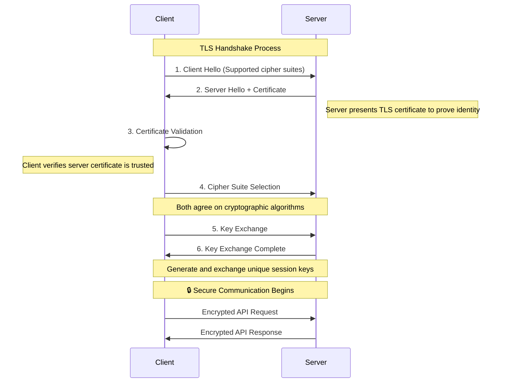
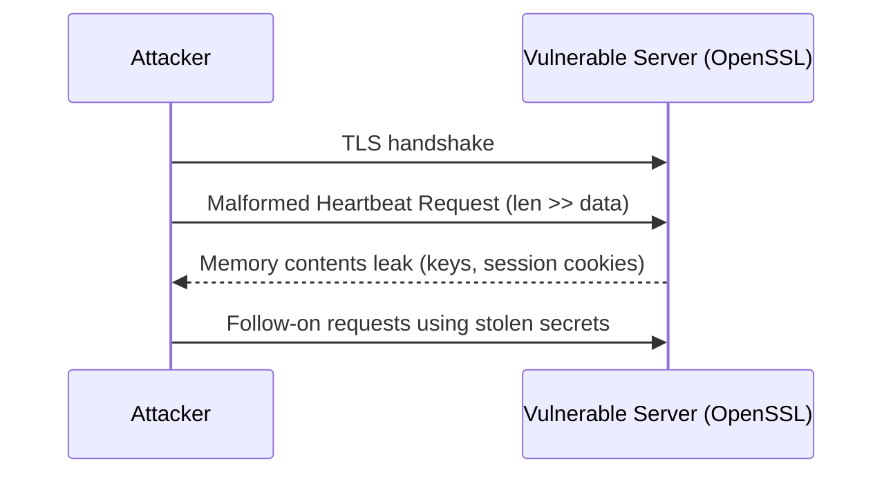

# TLS Encryption and HTTPS Best Practices for APIs

---

## Key Takeaways

When a client and an API exchange information, that data travels across the internet, a public network. Without protection, this data gets intercepted and read by malicious actors. This is where encryption comes in.

**In this guide, you'll learn:**
- How TLS 1.3 provides secure communication for APIs
- OpenAPI server URL security contracts and enforcement  
- Certificate management and cipher suite selection
- Mutual TLS (mTLS) for service-to-service communication
- Real-world lessons from the Heartbleed vulnerability
- Automated governance for transport security

---

## The Banking Vault Principle

> **The Banking Vault Principle**: When banks transfer large sums between branches, they don't send cash in regular envelopes. They use armored vehicles with multiple security layers. TLS encryption works similarly — it creates a secure transport layer that protects your API data during transit, even across untrusted networks.

**Encryption in transit** works similarly, creating a secure, private tunnel for API data as it moves between the client and the server.

## TLS 1.3: The Modern Standard

This secure tunnel is primarily established using **Transport Layer Security (TLS) version 1.3**, as specified in [IETF RFC 8446](https://tools.ietf.org/html/rfc8446). [NIST SP 800-52 Rev. 2](https://csrc.nist.gov/publications/detail/sp/800-52/rev-2/final) guidelines for TLS implementations unequivocally mandate TLS 1.3 for modern systems, as older protocols—including all versions of SSL, TLS 1.0, and TLS 1.1—are deprecated and considered insecure due to known vulnerabilities.

When a client connects to an API over `https://`, it initiates a "TLS handshake." During this handshake, the client and server perform crucial steps:

1. **Authentication:** The server presents its TLS certificate to the client to prove its identity, ensuring the client is talking to the legitimate server and not an impostor.  
2. **Agreement on Encryption:** They agree on a set of cryptographic algorithms (a "cipher suite") to use for the session.  
3. **Key Exchange:** They securely generate and exchange unique session keys that will be used to encrypt and decrypt all data for the remainder of the conversation.

### TLS Handshake Process



*Sequence diagram illustrating the TLS handshake process between client and server, showing certificate validation, cipher suite selection, and secure key exchange that ensures encrypted API communication.*

## TLS Security Guarantees

TLS, when done right, provides three essential security guarantees:

* **Confidentiality:** It encrypts the data, preventing eavesdroppers from reading it.  
* **Integrity:** It ensures that the data has not been altered or tampered with during transit.  
* **Authentication:** It verifies the identity of the server, protecting against man-in-the-middle attacks.

This is why secure APIs always use URLs that start with `https://` instead of `http://`. The 's' stands for 'secure' and indicates that the connection is protected by TLS encryption.

## TLS Implementation Best Practices

In production environments, telling teams to "use HTTPS" without specifics sometimes leads to misconfigured TLS and a false sense of security. Proper TLS implementation requires:

* **Enforcing Strong Cipher Suites**: Configure servers to only negotiate cryptographic algorithms that are considered secure, disabling weak or obsolete ciphers
* **Proper Certificate Management**: Use certificates from trusted Certificate Authorities (CAs), ensure they are not expired, and implement robust processes for certificate issuance, renewal, and revocation
* **Protection Against Man-in-the-Middle (MiTM) Attacks**: Implement HTTP Strict Transport Security (HSTS) to instruct browsers to only communicate over HTTPS, preventing protocol downgrade attacks

### Common TLS misconfigurations

* Weak or legacy protocols enabled (SSL, TLS 1.0/1.1) — disable them explicitly
* Missing HSTS header — add Strict-Transport-Security with long max-age
* Mixed content or accidental HTTP endpoints — redirect to HTTPS at the edge
* Expiring certificates — monitor expiry and automate renewal

Quick checks:

```bash
# Verify protocol and cipher suites
openssl s_client -connect api.example.com:443 -tls1_3 -cipher 'TLS_AES_256_GCM_SHA384' < /dev/null | grep -E 'Protocol|Cipher'

# Scan for common TLS issues
testssl.sh --fast https://api.example.com
```

> Expert insight: "Treat TLS as a product with owners and SLAs. We track TLS health on dashboards the same way we track latency and errors."

## Enforcing HTTPS in Your API Specification

The security contract for encrypted transit begins within the `servers` object of your OpenAPI specification. Every URL defined here must use the `https://` scheme—this isn't just documentation, it's a formal declaration of your API's secure endpoints.

**OpenAPI Servers Declaration:**
```yaml 
servers:
  - url: https://api.production.com/v1
    description: Production Server
  - url: https://api.staging.com/v1
    description: Staging Server
```

### Automated Governance Enforcement

Modern API governance tools can enforce HTTPS usage through automated validation rules. When integrated into your CI/CD pipeline, automated governance creates security gates. If a developer attempts to commit an OpenAPI file with insecure server URLs, the pipeline fails with a clear error message, preventing insecure configurations from ever reaching production.

*Automated governance tools fail CI/CD builds when OpenAPI specifications use HTTP instead of HTTPS, requiring developers to fix security violations before deployment.*

## TLS Configuration Examples

Authoritative sources like the [Mozilla SSL Configuration Generator](https://ssl-config.mozilla.org/) provide excellent, up-to-date templates for secure server configurations across different platforms and security requirements.

**Nginx Configuration:**
```nginx
server {
    listen 443 ssl http2;
    server_name api.example.com;
    
    # TLS 1.3 only
    ssl_protocols TLSv1.3;
    
    # Strong cipher suites
    ssl_ciphers TLS_AES_256_GCM_SHA384:TLS_CHACHA20_POLY1305_SHA256:TLS_AES_128_GCM_SHA256;
    
    # HSTS header
    add_header Strict-Transport-Security "max-age=31536000; includeSubDomains" always;
    
    # Certificate files
    ssl_certificate /path/to/certificate.crt;
    ssl_certificate_key /path/to/private.key;
}
```

**Express.js Configuration:**
```javascript
const https = require('https');
const fs = require('fs');
const express = require('express');

const app = express();

// HSTS middleware
app.use((req, res, next) => {
  res.setHeader('Strict-Transport-Security', 'max-age=31536000; includeSubDomains');
  next();
});

const options = {
  key: fs.readFileSync('private.key'),
  cert: fs.readFileSync('certificate.crt'),
  // Force TLS 1.3
  secureProtocol: 'TLSv1_3_method'
};

https.createServer(options, app).listen(443);
```

## Attack Example: Heartbleed (TLS library vulnerability, 2014)

The Heartbleed bug (CVE-2014-0160) was a critical vulnerability in the OpenSSL library, not the TLS protocol itself. It allowed attackers to read up to 64KB of a server's memory by sending a malformed TLS heartbeat request. The server would respond with not only the small payload sent by the attacker but also adjacent memory contents, which could include session cookies, user credentials, and even the server's private encryption keys.

This incident demonstrates a crucial point: security is multi-layered. While an OpenAPI specification can enforce the *intent* of using secure transport (https://), it cannot prevent a runtime vulnerability in the underlying software stack. True "secure by design" requires both design-time governance via OpenAPI linting and runtime security posture management, including diligent vulnerability scanning and patch management.



*Sequence diagram showing the Heartbleed attack: malformed TLS heartbeat requests cause vulnerable OpenSSL servers to leak memory contents including encryption keys and session data.*

Why this matters: TLS is only as strong as its implementation. Monitoring and rapid patching for library CVEs are part of infrastructure security.

## Mutual TLS (mTLS): Two-Way Authentication

While standard TLS only authenticates the server to the client, **Mutual TLS (mTLS)** requires both parties to authenticate each other using certificates. This provides stronger security for high-trust scenarios and is essential for implementing zero-trust architecture principles.

**mTLS Use Cases:**
- Microservice communication in zero-trust architectures where no network segment is inherently trusted
- API-to-API authentication between organizations implementing defense-in-depth strategies
- IoT device authentication in distributed systems
- High-security financial and healthcare APIs requiring cryptographic identity verification

**OpenAPI mTLS Configuration:**
```yaml 
components:
  securitySchemes:
    mtlsAuth:
      type: mutualTLS
      description: "Client certificate authentication"

# Apply to sensitive operations
paths:
  /internal/payments:
    post:
      security:
        - mtlsAuth: []
      summary: "Process payment (internal service only)"
```

**Implementation Example (Nginx):**
```nginx
server {
    listen 443 ssl http2;
    
    # Server certificate
    ssl_certificate /path/to/server.crt;
    ssl_certificate_key /path/to/server.key;
    
    # Require client certificates
    ssl_verify_client on;
    ssl_client_certificate /path/to/ca.crt;
    
    # Pass client certificate info to backend
    proxy_set_header X-Client-Cert $ssl_client_cert;
    proxy_set_header X-Client-Verify $ssl_client_verify;
}
```

> **mTLS Best Practice**: Use mTLS for service-to-service communication and regular TLS + [JWT/OAuth2](authentication-authorization-openapi) for client-to-server communication.

## TLS Monitoring and Troubleshooting

### Certificate Monitoring
```yaml 
groups:
- name: tls_alerts
  rules:
  - alert: TLSCertificateExpiringSoon
    expr: probe_ssl_earliest_cert_expiry - time() < 86400 * 30
    labels:
      severity: warning
    annotations:
      summary: "TLS certificate expires in less than 30 days"

  - alert: WeakTLSVersion
    expr: probe_tls_version_info{version!="TLS 1.3"} == 1
    labels:
      severity: critical
    annotations:
      summary: "Weak TLS version detected"
```

### Common TLS Troubleshooting Steps

**Certificate Issues:**
- Expired certificates — monitor expiry dates and automate renewal
- Certificate chain problems — verify intermediate certificates are included
- Certificate-hostname mismatch — ensure certificate covers all domains used

**Configuration Issues:**  
- Weak cipher suites — disable deprecated algorithms and enable only strong ciphers
- Missing HSTS headers — add Strict-Transport-Security to prevent downgrade attacks
- Mixed content warnings — ensure all resources load over HTTPS

**Quick Verification Commands:**
```bash
# Test TLS connection and certificate
curl -vI https://api.example.com 2>&1 | grep -E 'SSL|TLS|certificate'

# Verify certificate chain
openssl s_client -showcerts -connect api.example.com:443 < /dev/null

# Check certificate expiry
echo | openssl s_client -servername api.example.com -connect api.example.com:443 2>/dev/null | \
openssl x509 -noout -dates
```

## Frequently Asked Questions

### Why can't I use HTTP for internal APIs?
Even internal networks can be compromised. Using HTTPS everywhere (zero-trust approach) protects against insider threats, lateral movement attacks, and accidental data exposure. The performance overhead of TLS is minimal with modern hardware and HTTP/2.

### How often should I rotate TLS certificates?
Most organizations use certificates with 1-year validity and rotate them every 6-12 months. Automated certificate management tools like Let's Encrypt or cloud provider certificate services can handle this automatically.

### What's the difference between TLS and SSL?
SSL (Secure Sockets Layer) is the predecessor to TLS. SSL versions are deprecated and insecure. When people say "SSL certificate" or "SSL/TLS," they're usually referring to modern TLS. Always use TLS 1.2 or preferably TLS 1.3.

### Should I implement certificate pinning for API clients?
Certificate pinning can improve security by preventing man-in-the-middle attacks, but it adds operational complexity. Consider it for high-security applications, but ensure you have a robust certificate rotation and backup pin management process.

## Resources and Next Steps

### Essential Reading
- [IETF RFC 8446](https://tools.ietf.org/html/rfc8446) - TLS 1.3 protocol specification and security requirements
- [NIST SP 800-52 Rev. 2](https://csrc.nist.gov/publications/detail/sp/800-52/rev-2/final) - Official guidelines for secure TLS implementation
- [Mozilla SSL Configuration Generator](https://ssl-config.mozilla.org/) - Generate secure TLS configurations for various platforms

### Implementation Tools  
- [Let's Encrypt](https://letsencrypt.org/) - Free, automated certificate authority for TLS certificates
- [testssl.sh](https://testssl.sh/) - Command-line tool for testing TLS/SSL implementations
- [SSL Labs Server Test](https://www.ssllabs.com/ssltest/) - Online tool for testing TLS configuration

### Related Security Topics
- [API Input Validation and Injection Prevention](api-input-validation-injection-prevention) - Protect APIs from malicious data
- [Authentication and Authorization with OpenAPI](authentication-authorization-openapi) - Implement secure access control
- [API Rate Limiting and Abuse Prevention](api-rate-limiting-abuse-prevention) - Prevent DoS attacks and brute force attempts
- [API Security by Design: Complete Guide](/learn/security) - Overview of all API security domains

---

**Next Steps:** Now that you have secure transport with TLS, learn about [API Input Validation and Injection Prevention](api-input-validation-injection-prevention) to protect your APIs from malicious data inputs.