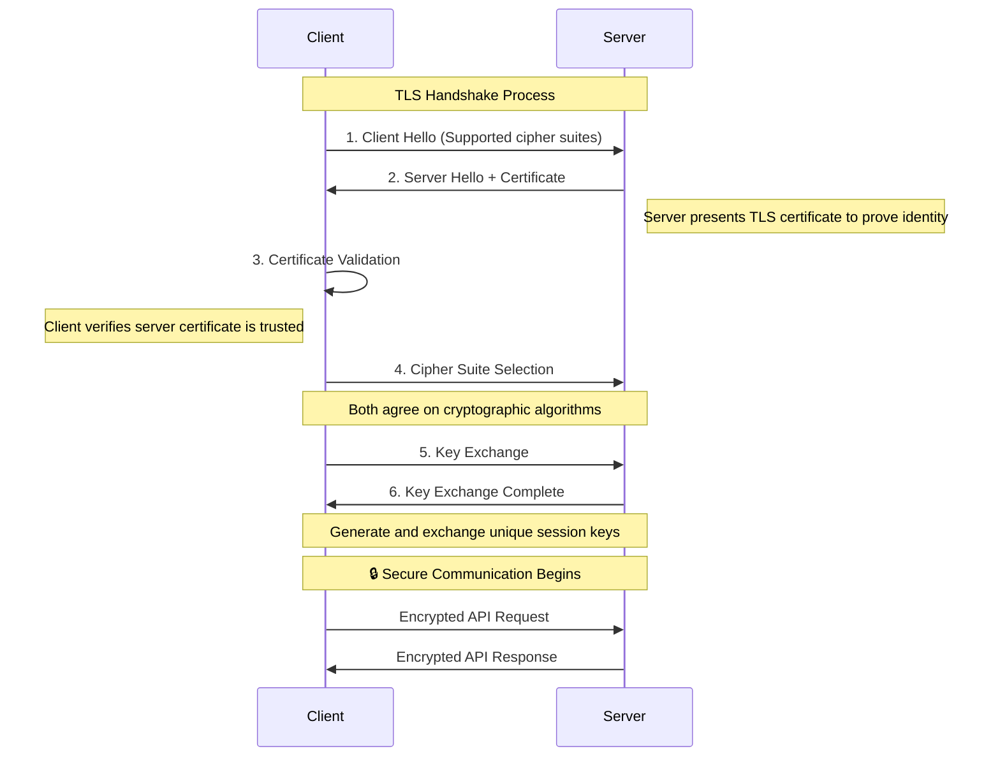
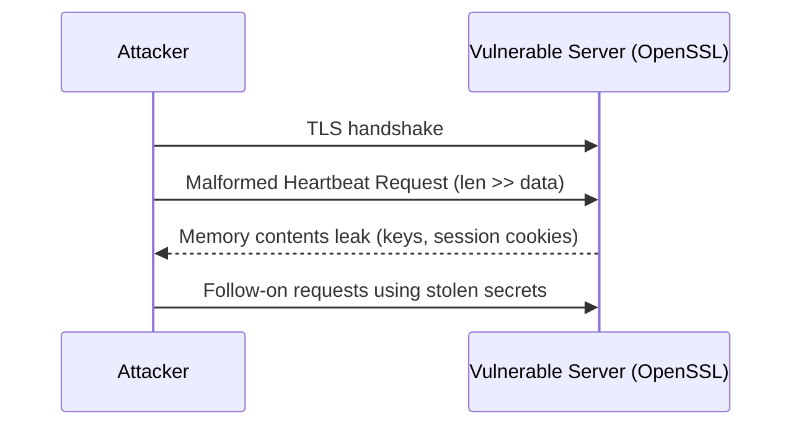

# TLS encryption and HTTPS best practices for APIs

---

## Key takeaways

When a client and an API exchange information, that data travels across the internet, a public network. Without protection, this data gets intercepted and read by malicious actors. This is where encryption comes in.

**In this guide, you'll learn:**
- [How TLS 1.3 provides secure communication](#tls-13-the-modern-standard) for APIs
- [OpenAPI server URL security contracts](#enforcing-https-in-your-api-specification) and enforcement  
- [Certificate management and TLS configuration](#tls-configuration-examples) examples
- [Mutual TLS (mTLS) for service-to-service communication](#mutual-tls-mtls-two-way-authentication)
- [Real-world lessons from the Heartbleed vulnerability](#attack-example-heartbleed-tls-library-vulnerability-2014)
- [Automated governance for transport security](#automated-governance-enforcement)

---

## Quick start guide

Ready to implement secure TLS encryption? Follow these steps:

1. **Upgrade to TLS 1.3:** Implement [modern TLS 1.3](#tls-13-the-modern-standard) with strong cipher suites and disable legacy protocols
2. **Configure your server:** Choose your technology stack from our [configuration examples](#tls-configuration-examples) (Nginx or Express.js)
3. **Enforce HTTPS in specs:** Update [OpenAPI server URLs](#enforcing-https-in-your-api-specification) to use HTTPS only with automated governance
4. **Set up monitoring:** Implement [certificate monitoring](#tls-monitoring-and-troubleshooting) to track expiration dates and TLS configuration
5. **Consider mTLS:** For service-to-service communication, evaluate [mutual TLS](#mutual-tls-mtls-two-way-authentication) for cryptographic client authentication

**Next Steps:** Now that you have secure transport with TLS, learn about [API Input Validation and Injection Prevention](api-input-validation-injection-prevention) to protect your APIs from malicious data inputs.

---

## The banking vault principle

> **The Banking Vault Principle**: When banks transfer large sums between branches, they don't send cash in regular envelopes. They use armored vehicles with multiple security layers. TLS encryption works similarly — it creates a secure transport layer that protects your API data during transit, even across untrusted networks.

**Encryption in transit** works similarly, creating a secure, private tunnel for API data as it moves between the client and the server.

## TLS 1.3: The modern standard

This secure tunnel is primarily established using **Transport Layer Security (TLS) version 1.3**, as specified in [IETF RFC 8446](https://tools.ietf.org/html/rfc8446). [NIST SP 800-52 Rev. 2](https://csrc.nist.gov/publications/detail/sp/800-52/rev-2/final) guidelines for TLS implementations unequivocally mandate TLS 1.3 for modern systems, as older protocols—including all versions of SSL, TLS 1.0, and TLS 1.1—are deprecated and considered insecure due to known vulnerabilities.

When a client connects to an API over `https://`, it initiates a "TLS handshake." During this handshake, the client and server perform crucial steps:

1. **Authentication:** The server presents its TLS certificate to the client to prove its identity, ensuring the client is talking to the legitimate server and not an impostor.  
2. **Agreement on Encryption:** They agree on a set of cryptographic algorithms (a "cipher suite") to use for the session.  
3. **Key Exchange:** They securely generate and exchange unique session keys that will be used to encrypt and decrypt all data for the remainder of the conversation.

### TLS handshake process



*Sequence diagram illustrating the TLS handshake process between client and server, showing certificate validation, cipher suite selection, and secure key exchange that ensures encrypted API communication.*

## TLS security guarantees

TLS, when done right, provides three essential security guarantees:

* **Confidentiality:** It encrypts the data, preventing eavesdroppers from reading it.  
* **Integrity:** It ensures that the data has not been altered or tampered with during transit.  
* **Authentication:** It verifies the identity of the server, protecting against man-in-the-middle attacks.

This is why secure APIs always use URLs that start with `https://` instead of `http://`. The 's' stands for 'secure' and indicates that the connection is protected by TLS encryption.

## TLS implementation best practices

In production environments, telling teams to "use HTTPS" without specifics sometimes leads to misconfigured TLS and a false sense of security. Proper TLS implementation requires:

* **Enforcing Strong Cipher Suites**: Configure servers to only negotiate cryptographic algorithms that are considered secure, disabling weak or obsolete ciphers
* **Proper Certificate Management**: Use certificates from trusted Certificate Authorities (CAs), ensure they are not expired, and implement robust processes for certificate issuance, renewal, and revocation
* **Protection Against Man-in-the-Middle (MiTM) Attacks**: Implement HTTP Strict Transport Security (HSTS) to instruct browsers to only communicate over HTTPS, preventing protocol downgrade attacks

### Common TLS misconfigurations

* Weak or legacy protocols enabled (SSL, TLS 1.0/1.1) — disable them explicitly
* Missing HSTS header — add Strict-Transport-Security with long max-age
* Mixed content or accidental HTTP endpoints — redirect to HTTPS at the edge
* Expiring certificates — monitor expiry and automate renewal

Quick checks:

```bash
# Verify protocol and cipher suites
openssl s_client -connect api.example.com:443 -tls1_3 -cipher 'TLS_AES_256_GCM_SHA384' < /dev/null | grep -E 'Protocol|Cipher'

# Scan for common TLS issues
testssl.sh --fast https://api.example.com
```

> Expert insight: "Treat TLS as a product with owners and SLAs. We track TLS health on dashboards the same way we track latency and errors."

## Enforcing HTTPS in your API specification

The security contract for encrypted transit begins within the `servers` object of your OpenAPI specification. Every URL defined here must use the `https://` scheme—this isn't just documentation, it's a formal declaration of your API's secure endpoints.

**OpenAPI HTTPS Enforcement**

```yaml 
# CRITICAL SECURITY: Only HTTPS servers in production OpenAPI specs  # [!code error]
servers:
  - url: https://api.production.com/v1  # [!code warning] ESSENTIAL: HTTPS only for production
    description: Production Server
  - url: https://api.staging.com/v1     # [!code warning] ESSENTIAL: HTTPS only for staging
    description: Staging Server
  # Never include HTTP servers in production specs  # [!code highlight] DANGEROUS: HTTP servers are vulnerable
  # - url: http://api.example.com/v1    # [!code error] NEVER DO THIS: Allows man-in-the-middle attacks
```

**Security Benefits**:
- **Prevents man-in-the-middle attacks** by encrypting all API traffic  
- **Protects sensitive data** (API keys, user credentials, personal information) in transit
- **Enables modern web features** that require secure contexts (Service Workers, etc.)
- **Improves SEO and user trust** with browser security indicators

### Automated governance enforcement

Modern API governance tools can enforce HTTPS usage through automated validation rules. When integrated into your CI/CD pipeline, automated governance creates security gates. If a developer attempts to commit an OpenAPI file with insecure server URLs, the pipeline fails with a clear error message, preventing insecure configurations from ever reaching production.

*Automated governance tools fail CI/CD builds when OpenAPI specifications use HTTP instead of HTTPS, requiring developers to fix security violations before deployment.*

## TLS configuration examples

Choose your server configuration based on your technology stack. Authoritative sources like the [Mozilla SSL Configuration Generator](https://ssl-config.mozilla.org/) provide excellent, up-to-date templates for secure server configurations.


  

### Production Nginx TLS configuration

```nginx 
server {
    # STEP 1: Enable HTTPS with HTTP/2 for performance and security  # [!code highlight]
    listen 443 ssl http2;            # Port 443 = HTTPS, http2 = faster + more secure
    server_name api.example.com;     # Your API domain - must match certificate CN/SAN
    
    # STEP 2: Force TLS 1.3 only - disables ALL vulnerable older versions  # [!code highlight]
    ssl_protocols TLSv1.3;           # [!code error] CRITICAL: Blocks SSL, TLS 1.0, 1.1, 1.2 vulnerabilities
    
    # STEP 3: Define strong cipher suites (TLS 1.3 has built-in secure ciphers)  # [!code highlight]
    # These are the only ciphers clients can negotiate - all are AEAD (authenticated encryption)
    ssl_ciphers TLS_AES_256_GCM_SHA384:TLS_CHACHA20_POLY1305_SHA256:TLS_AES_128_GCM_SHA256;
    
    # STEP 4: Security headers - prevent client-side attacks  # [!code highlight]
    # HSTS: Forces browsers to use HTTPS for ALL future requests (even if user types http://)
    add_header Strict-Transport-Security "max-age=31536000; includeSubDomains" always;
    
    # Additional security headers for defense in depth
    add_header X-Frame-Options DENY always;                    # Prevent clickjacking
    add_header X-Content-Type-Options nosniff always;          # Prevent MIME confusion attacks
    add_header Referrer-Policy "strict-origin-when-cross-origin" always; # Limit referrer leakage
    
    # STEP 5: TLS Certificate configuration - THE MOST CRITICAL PART  # [!code highlight]
    ssl_certificate /path/to/certificate.crt;      # Public certificate (safe to share)
    ssl_certificate_key /path/to/private.key;      # [!code error] CRITICAL: PRIVATE KEY - never share, restrict access!
    
    # STEP 6: Certificate security best practices  # [!code highlight]
    ssl_certificate_transparency on;               # Enable CT logging for transparency
    ssl_stapling on;                              # OCSP stapling - faster cert validation
    ssl_stapling_verify on;                       # Verify OCSP responses
    ssl_trusted_certificate /path/to/chain.pem;   # Certificate chain for OCSP validation
    
    # STEP 7: Performance optimizations that also improve security  # [!code highlight]
    ssl_session_cache shared:SSL:10m;             # Session resumption (avoids full handshake)
    ssl_session_timeout 10m;                      # Limit session lifetime
    ssl_prefer_server_ciphers off;                # Let client choose (TLS 1.3 best practice)
    
    # Your API routes go here...
    location / {
        # API backend configuration
    }
}

# STEP 8: Redirect ALL HTTP traffic to HTTPS (never serve HTTP in production)  # [!code highlight]
server {
    listen 80;                                    # [!code highlight] WARNING: HTTP port - only for redirects!
    server_name api.example.com;
    return 301 https://$server_name$request_uri;  # Permanent redirect to HTTPS
}
```

**Critical Configuration Notes**:
- **TLS 1.3 only**: Disables vulnerable older protocols (SSL, TLS 1.0/1.1/1.2)
- **Strong ciphers**: Only allows cryptographically secure cipher suites
- **HTTP/2**: Improves performance while maintaining security
- **HSTS header**: Forces browsers to use HTTPS, prevents downgrade attacks




### Express.js HTTPS server with security headers

```javascript 
const https = require('https');
const fs = require('fs');
const express = require('express');

const app = express();

// HSTS middleware - ALWAYS force HTTPS for all future requests  // [!code highlight]
app.use((req, res, next) => {
  res.setHeader('Strict-Transport-Security', 'max-age=31536000; includeSubDomains');
  next();
});

// TLS configuration - secure defaults  // [!code highlight]
const options = {
  key: fs.readFileSync('private.key'),      // [!code error] CRITICAL: Keep private key secure!
  cert: fs.readFileSync('certificate.crt'), // Certificate file
  secureProtocol: 'TLSv1_3_method'          // [!code highlight] SECURITY: Force TLS 1.3 only
};

// Start HTTPS server on port 443 - NEVER use HTTP in production  // [!code highlight]
https.createServer(options, app).listen(443, () => {
  console.log('Secure API server running on https://localhost:443');
});
```

**Security Implementation Details**:
- **HSTS middleware**: Prevents protocol downgrade attacks by forcing HTTPS
- **TLS 1.3 only**: Disables vulnerable older TLS versions
- **Certificate management**: Loads TLS certificate and private key from secure files
- **Port 443**: Standard HTTPS port for production APIs




## Attack example: Heartbleed (TLS library vulnerability, 2014)

The Heartbleed bug (CVE-2014-0160) was a critical vulnerability in the OpenSSL library, not the TLS protocol itself. It allowed attackers to read up to 64KB of a server's memory by sending a malformed TLS heartbeat request. The server would respond with not only the small payload sent by the attacker but also adjacent memory contents, which could include session cookies, user credentials, and even the server's private encryption keys.

This incident demonstrates a crucial point: security is multi-layered. While an OpenAPI specification can enforce the *intent* of using secure transport (https://), it cannot prevent a runtime vulnerability in the underlying software stack. True "secure by design" requires both design-time governance via OpenAPI linting and runtime security posture management, including diligent vulnerability scanning and patch management.



*Sequence diagram showing the Heartbleed attack: malformed TLS heartbeat requests cause vulnerable OpenSSL servers to leak memory contents including encryption keys and session data.*

Why this matters: TLS is only as strong as its implementation. Monitoring and rapid patching for library CVEs are part of infrastructure security.

## Mutual TLS (mTLS): Two-way authentication

While standard TLS only authenticates the server to the client, **Mutual TLS (mTLS)** requires both parties to authenticate each other using certificates. This provides stronger security for high-trust scenarios and is essential for implementing zero-trust architecture principles.

**mTLS Use Cases:**
- Microservice communication in zero-trust architectures where no network segment is inherently trusted
- API-to-API authentication between organizations implementing defense-in-depth strategies
- IoT device authentication in distributed systems
- High-security financial and healthcare APIs requiring cryptographic identity verification

**OpenAPI mTLS Security Definition**

```yaml 
components:
  securitySchemes:
    mtlsAuth:
      type: mutualTLS                     # [!code highlight]
      description: "Client certificate authentication for zero-trust architecture" # [!code highlight]

# Apply mTLS to sensitive internal operations
paths:
  /internal/payments:
    post:
      security:
        - mtlsAuth: []                    # [!code highlight]
      summary: "Process payment (internal service only)"
  /public/info:
    get:
      # No mTLS required for public endpoints # [!code highlight]
      summary: "Public information endpoint"
```

**mTLS Security Benefits**:
- **Cryptographic authentication**: Both client and server prove identity with certificates
- **Zero-trust architecture**: No implicit trust based on network location
- **Non-repudiation**: Certificate-based proof of communication participants

**mTLS Nginx Configuration**

```nginx 
server {
    listen 443 ssl http2;
    
    # Server certificate (authenticates server to client)
    ssl_certificate /path/to/server.crt;       # Public certificate for server identity
    ssl_certificate_key /path/to/server.key;   # Private key (keep secure!)
    
    # Client certificate verification (authenticates client to server)
    ssl_verify_client on;                      # Require valid client certificates
    ssl_client_certificate /path/to/ca.crt;    # CA that signed client certificates
    
    # Pass client certificate details to application
    proxy_set_header X-Client-Cert $ssl_client_cert;      # Full client certificate
    proxy_set_header X-Client-Verify $ssl_client_verify;  # Verification status
    proxy_set_header X-Client-DN $ssl_client_s_dn;        # Client Distinguished Name
}
```

**mTLS Flow**: Client presents certificate → Nginx validates against CA → Application receives verified client identity → Both parties authenticated cryptographically

> **mTLS Best Practice**: Use mTLS for service-to-service communication and regular TLS + [JWT/OAuth2](authentication-authorization-openapi) for client-to-server communication.

## TLS monitoring and troubleshooting

Choose your monitoring approach based on your infrastructure:


  

### Certificate monitoring

```yaml 
groups:
- name: tls_alerts
  rules:
  - alert: TLSCertificateExpiringSoon
    expr: probe_ssl_earliest_cert_expiry - time() < 86400 * 30  # [!code highlight] 30-day warning
    labels:
      severity: warning
    annotations:
      summary: "TLS certificate expires in less than 30 days"

  - alert: WeakTLSVersion
    expr: probe_tls_version_info{version!="TLS 1.3"} == 1       # [!code highlight] TLS version check
    labels:
      severity: critical
    annotations:
      summary: "Weak TLS version detected"
```

**How certificate monitoring works:**
- **Expiration alerts**: Warns 30 days before certificate expiry to allow renewal time
- **TLS version monitoring**: Detects servers using outdated TLS versions
- **Automated scanning**: Regularly probes endpoints to verify TLS configuration
- **Alert routing**: Sends notifications to security and ops teams for immediate action




### Common TLS troubleshooting steps

**Certificate Issues:**
- Expired certificates — monitor expiry dates and automate renewal
- Certificate chain problems — verify intermediate certificates are included
- Certificate-hostname mismatch — ensure certificate covers all domains used

**Configuration Issues:**  
- Weak cipher suites — disable deprecated algorithms and enable only strong ciphers
- Missing HSTS headers — add Strict-Transport-Security to prevent downgrade attacks
- Mixed content warnings — ensure all resources load over HTTPS

**Quick Verification Commands:**
```bash
# Test TLS connection and certificate
curl -vI https://api.example.com 2>&1 | grep -E 'SSL|TLS|certificate'

# Verify certificate chain
openssl s_client -showcerts -connect api.example.com:443 < /dev/null

# Check certificate expiry
echo | openssl s_client -servername api.example.com -connect api.example.com:443 2>/dev/null | \
openssl x509 -noout -dates
```

**Common issues and solutions:**
- **Certificate chain issues**: Use `openssl s_client -showcerts` to verify intermediate certificates
- **TLS version problems**: Check server configuration restricts to TLS 1.3 only
- **HSTS warnings**: Add `Strict-Transport-Security` header to prevent downgrade attacks




## Frequently asked questions

### Why can't I use HTTP for internal APIs?
Even internal networks can be compromised. Using HTTPS everywhere (zero-trust approach) protects against insider threats, lateral movement attacks, and accidental data exposure. The performance overhead of [TLS 1.3](#tls-13-the-modern-standard) is minimal with modern hardware and HTTP/2. See [OpenAPI HTTPS enforcement](#enforcing-https-in-your-api-specification) for implementation guidance.

### How often should I rotate TLS certificates?
Most organizations use certificates with 1-year validity and rotate them every 6-12 months. Automated certificate management tools like Let's Encrypt or cloud provider certificate services can handle this automatically. Implement [certificate monitoring](#tls-monitoring-and-troubleshooting) to track expiration dates.

### What's the difference between TLS and SSL?
SSL (Secure Sockets Layer) is the predecessor to TLS. SSL versions are deprecated and insecure. When people say "SSL certificate" or "SSL/TLS," they're usually referring to modern TLS. Always use [TLS 1.2 or preferably TLS 1.3](#tls-13-the-modern-standard) as shown in our [configuration examples](#tls-configuration-examples).

### Should I implement certificate pinning for API clients?
Certificate pinning can improve security by preventing man-in-the-middle attacks, but it adds operational complexity. Consider it for high-security applications, but ensure you have a robust certificate rotation and backup pin management process.

## Resources and next steps

### Essential Reading
- [IETF RFC 8446](https://tools.ietf.org/html/rfc8446) - TLS 1.3 protocol specification and security requirements
- [NIST SP 800-52 Rev. 2](https://csrc.nist.gov/publications/detail/sp/800-52/rev-2/final) - Official guidelines for secure TLS implementation
- [Mozilla SSL Configuration Generator](https://ssl-config.mozilla.org/) - Generate secure TLS configurations for various platforms

### Implementation Tools  
- [Let's Encrypt](https://letsencrypt.org/) - Free, automated certificate authority for TLS certificates
- [testssl.sh](https://testssl.sh/) - Command-line tool for testing TLS/SSL implementations
- [SSL Labs Server Test](https://www.ssllabs.com/ssltest/) - Online tool for testing TLS configuration

### Related Security Topics
- [API Input Validation and Injection Prevention](api-input-validation-injection-prevention) - Protect APIs from malicious data
- [Authentication and Authorization with OpenAPI](authentication-authorization-openapi) - Implement secure access control
- [API Rate Limiting and Abuse Prevention](api-rate-limiting-abuse-prevention) - Prevent DoS attacks and brute force attempts
- [API Security by Design: Complete Guide](/learn/security) - Overview of all API security domains