# API Security by Design: Framework and Fundamentals

_Build secure APIs from the ground up using OpenAPI security contracts and automated governance._

---

## Key Takeaways

Many teams discover security vulnerabilities after they're already in production, but it doesn't have to be that way!

This comprehensive guide shows you how to turn your OpenAPI specification into a security contract that actually gets enforced. You'll learn to implement TLS encryption, input validation, rate limiting policies, and access control. By the time you're done, you'll know how to catch security issues during the design phase instead of scrambling to fix them once they're in production.

**What you'll learn:**
- Transform your OpenAPI specs into executable security policies
- Automate security enforcement in your CI/CD pipeline
- Reduce vulnerability discovery time (from months to minutes in some cases)
- Build APIs that are secure by design upfront

---

## From Reactive Patching to Proactive API Security

High-profile data breaches frequently trace back to insecure APIs, exposing a fundamental flaw in traditional security approaches. The conventional method—identifying and patching vulnerabilities in production—is reactive, costly, and ultimately inadequate. In its typical form, this paradigm treats security as an afterthought.

Shifting security practices to the left in the development lifecycle, known as the "shift-left" imperative, addresses this by integrating security into the earliest stages of design and development. This proactive model prevents vulnerabilities from being introduced in the first place, rather than attempting to remediate them under pressure in production environments.

### OpenAPI as Your Security Contract

The core of this strategy is treating your OpenAPI specification not merely as documentation, but as an executable security contract. This contract declaratively defines a set of security requirements, constraints, and policies before any application code is written. It becomes the single source of truth that dictates how an API must behave to be considered secure, effectively implementing a "policy-as-code" approach for APIs.

However, a contract, much like a law, is only as strong as its enforcement. This is where automated governance and linting tools provide value by transforming your contract into dynamic, automated guardrails that validate security requirements at every stage of development. When integrated into a Continuous Integration/Continuous Deployment (CI/CD) pipeline, this automated governance acts as a gatekeeper, failing builds that violate the security contract and requiring fixes before deployment.

## The Four Pillars of API Security

Building secure APIs doesn't have to feel like playing whack-a-mole with vulnerabilities. Once you shift from reactive patching to proactive design, you'll wonder why you ever did it any other way. Let's explore how to make security an automatic part of your API development process.

```mermaid
graph TD
    A["🏛️ Secure API Foundation"] --> B["🔐 TLS Encryption<br/>Data in Transit"]
    A --> C["✅ Input Validation<br/>Schema Contracts"]
    A --> D["⚡ Rate Limiting<br/>Abuse Prevention"]
    A --> E["🔑 Access Control<br/>Auth & Authorization"]
    
    B --> F["• HTTPS Enforcement<br/>• Certificate Management<br/>• Strong Cipher Suites"]
    C --> G["• JSON Schema Rules<br/>• Type Validation<br/>• Length Constraints"]
    D --> H["• x-rateLimit Extensions<br/>• 429 Response Headers<br/>• Multi-tier Limits"]
    E --> I["• Security Schemes<br/>• JWT/OAuth2<br/>• Scope Management"]
    
    J["📄 OpenAPI 3.1<br/>Specification"] --> A
    K["⚙️ Automated<br/>Governance"] --> A
    
    style A fill:#e8f5e8
    style B fill:#e3f2fd
    style C fill:#fff3e0
    style D fill:#fce4ec
    style E fill:#f1f8e9
    style J fill:#e1f5fe
    style K fill:#f3e5f5
```

*Architecture diagram showing the four essential areas of API security (TLS encryption, input validation, rate limiting, access control) supported by OpenAPI specifications and automated governance tools.*

## Deep Dive Guides

Each security domain requires specific knowledge and implementation techniques. Choose the guide that matches your current focus:

### <a href="/learn/security/api-tls-encryption-https-best-practices">API TLS Encryption and HTTPS Best Practices</a>
**What you'll learn:** Protect data in transit with proper TLS configuration, certificate management, and HTTPS enforcement.

**Key topics:**
- TLS 1.3 implementation and cipher suite selection
- OpenAPI server URL security contracts
- Mutual TLS (mTLS) for service-to-service communication
- Real-world case study: Heartbleed vulnerability and lessons learned
- Automated governance for transport security

**Perfect for:** Infrastructure teams, DevOps engineers, and security architects

---

### <a href="/learn/security/api-input-validation-injection-prevention">API Input Validation and Injection Prevention</a>  
**What you'll learn:** Stop injection attacks using OpenAPI schema validation and automated governance rules.

**Key topics:**
- JSON Schema security constraints and validation patterns
- Mass assignment attack prevention
- SQL injection and OGNL injection defense strategies
- Real-world case study: Equifax breach analysis
- Automated validation governance and linting

**Perfect for:** Backend developers, security engineers, and API architects

---

### <a href="/learn/security/api-rate-limiting-abuse-prevention">API Rate Limiting and Abuse Prevention</a>
**What you'll learn:** Prevent DoS attacks, brute force attempts, and business logic abuse through strategic rate limiting.

**Key topics:**
- Rate limiting algorithms and implementation patterns
- OpenAPI x-rateLimit extensions and documentation
- Multi-tier rate limiting strategies
- Real-world case study: Facebook phone number scraping incident
- Client-side backoff and error handling

**Perfect for:** API product managers, DevOps teams, and security operations

---

### <a href="/learn/security/authentication-authorization-openapi">Authentication and Authorization with OpenAPI</a>
**What you'll learn:** Implement secure access control using OpenAPI security schemes and modern authentication patterns.

**Key topics:**
- OpenAPI security schemes (JWT, OAuth2, API Keys, mTLS)
- Authentication vs authorization flow patterns
- Scope-based access control and permission systems
- Security scheme governance and automation
- Token validation and session management

**Perfect for:** Identity and access management teams, full-stack developers, and security engineers

## Understanding Design-Time vs Runtime Security

It's important to understand that OpenAPI-based security governance operates at **design-time**, not runtime. This governance approach excels at preventing configuration errors, missing security controls, and specification inconsistencies before they reach production. That said, it cannot prevent runtime vulnerabilities in the underlying implementation.

### API Security Implementation Timeline

*Timeline showing how API security spans from design-time specification through build automation to runtime enforcement, with different security controls applied at each phase.*

**Design-time security governance prevents:**
- Accidentally public endpoints (missing security requirements)
- Insecure server configurations (HTTP instead of HTTPS)
- Missing input validation constraints
- Inconsistent rate limiting policies
- Data leakage through unused components

**Runtime security still requires:**
- Patch management for frameworks and libraries (like the Heartbleed OpenSSL vulnerability)
- Secure coding practices and parameterized queries
- Infrastructure security monitoring and alerting
- Penetration testing and vulnerability scanning

True "secure by design" requires both: design-time contracts enforced through OpenAPI governance *and* runtime security posture management as part of a comprehensive DevSecOps practice.

## API Security Maturity Model

Implementing comprehensive API security is a journey. Organizations typically progress through distinct maturity levels as they build more sophisticated security practices:

*API security maturity progression showing the evolution from basic manual practices to proactive, automated security governance with comprehensive threat detection and prevention.*

**Level 0 - Basic Security:**
- Manual code reviews for obvious security issues
- HTTPS enabled but not enforced through specifications
- Basic authentication (API keys or simple passwords)
- Ad-hoc security practices without consistent standards

**Level 1 - Structured Security:**
- OpenAPI specifications document all APIs with security requirements
- Schema-based input validation prevents basic injection attacks
- Rate limiting implemented on authentication and sensitive endpoints
- Consistent security patterns across API teams

**Level 2 - Automated Security:**
- Automated governance tools enforce security standards in CI/CD pipelines
- Security policies defined as code and validated automatically
- Breaking changes to security configurations fail builds
- Security metrics tracked and monitored systematically

**Level 3 - Proactive Security:**
- Comprehensive threat modeling integrated into the design process
- Zero-trust architecture with mutual TLS for service-to-service communication
- Continuous security monitoring with behavioral analysis and anomaly detection
- Security feedback loops drive iterative improvements to governance policies

Most organizations find that advancing one level at a time provides the most sustainable improvement path. The techniques covered in this guide primarily support progression from Level 0 to Level 2, with Level 3 requiring additional infrastructure and organizational maturity.

## Frequently Asked Questions

### What is design-first API security?
Design-first API security means defining security requirements in your OpenAPI specification before writing code, then using automated governance tools to enforce those requirements throughout the development lifecycle. This prevents vulnerabilities from reaching production rather than patching them after discovery.

### How does OpenAPI prevent injection attacks?
OpenAPI specifications define precise data schemas with type validation, format constraints, and length limits. When enforced by governance tools, these schemas automatically reject malformed inputs that could contain injection payloads, stopping attacks before they reach your application logic.

### Why is rate limiting important for API security?
Rate limiting prevents denial-of-service attacks, brute-force authentication attempts, and data scraping. It ensures fair resource usage among legitimate users while blocking malicious automation. Without rate limits, a single bad actor can overwhelm your API infrastructure.

### Can I implement all four security areas with just OpenAPI?
Yes, OpenAPI 3.1 supports all four security areas: TLS enforcement through server URLs, input validation via JSON schemas, rate limiting through extensions like `x-rateLimit`, and access control via security schemes. Combined with governance automation, your specification becomes an executable security contract.

### What's the difference between authentication and authorization in APIs?
Authentication verifies *who* the user is (like checking an ID card), while authorization determines *what* they can do (like checking permissions). Both are essential for API security, and OpenAPI provides security schemes to define and enforce both concepts through your specification.

## Resources

### Security Standards and Guidelines
- <a href="https://owasp.org/www-project-api-security/" target="_blank">OWASP API Security Top 10</a> - Comprehensive vulnerability guide including injection attacks (API3:2023), resource consumption (API4:2023), and business logic abuse (API6:2023)
- <a href="https://csrc.nist.gov/publications/detail/sp/800-52/rev-2/final" target="_blank">NIST SP 800-52 Rev. 2</a> - Official guidelines for secure TLS implementation and configuration requirements
- <a href="https://tools.ietf.org/html/rfc8446" target="_blank">IETF RFC 8446</a> - TLS 1.3 protocol specification and security requirements

### Practical Implementation Tools
- <a href="https://ssl-config.mozilla.org/" target="_blank">Mozilla SSL Configuration Generator</a> - Generate secure, up-to-date TLS configurations for various web servers and security levels
- <a href="https://openapi-generator.tech/" target="_blank">OpenAPI Generator</a> - Code generation tool for creating secure client SDKs and server stubs from OpenAPI specifications
- <a href="https://spec.openapis.org/oas/v3.1.0" target="_blank">OpenAPI Specification</a> - Official OpenAPI 3.1 specification including security scheme definitions

### DevSecOps and API Governance
- <a href="https://owasp.org/www-project-api-security/" target="_blank">OWASP API Security Project</a> - Community-driven API security best practices and threat modeling
- <a href="https://spec.openapis.org/oas/v3.1.0#security-scheme-object" target="_blank">OpenAPI Security Schemes</a> - Official specification for defining authentication and authorization in OpenAPI