# Tools for API Testing in 2025

## Introduction: Beyond a list — a framework for your API testing stack

Is your organization struggling with the chaos of inconsistent API testing tools? When every team chooses its own solution, the result is often a mix of redundant, overlapping tools that create friction, produce inconsistent quality signals, and make it impossible to standardize best practices.

This guide provides a path out of that chaos. Instead of just another flat list of tools, it offers a strategic framework for evaluating and building a coherent testing stack. We walk through the layers of a modern API testing strategy, from validating the design contract to ensuring production reliability, so you can empower your teams with a paved road for quality.

### Four trends reshaping API testing in 2025

* **Shift-left as standard**: Testing moves into design and development, shrinking feedback loops and cost-to-fix.
* **AI/ML-assisted testing**: Automated test generation from specs, self-healing tests, and intelligent prioritization help teams scale quality.
* **Architectural fragmentation**: GraphQL and event-driven systems (AsyncAPI) demand schema-first validation and workflow-level testing, not just single request/response checks.
* **Developer Experience (DX)**: Git-friendly, CLI-first, docs-as-code workflows outperform platform-centric approaches for sustainable automation.


## The shift-left foundation: testing your API's design

The most effective way to improve quality and reduce costs is to shift left—integrating testing as early as possible in the software development lifecycle (SDLC). For APIs, this starts before a single line of code is written.

```mermaid
sequenceDiagram
    participant Design as 📋 Design Phase<br/>$1 to fix
    participant Dev as 💻 Development<br/>$10 to fix  
    participant Test as 🔍 Testing<br/>$50 to fix
    participant Prod as 🚀 Production<br/>$100+ to fix
    
    Design->>Dev: Defect flows downstream
    Dev->>Test: Cost increases 5x
    Test->>Prod: Cost doubles again
    
    Note over Design: Shift-left catches issues here
    Note over Prod: Emergency patches, downtime costs
```



### Shift-left in practice: automated API quality gates in CI/CD

Use the same commands locally and in CI to validate both your API design and its implementation.

```yaml
# .github/workflows/api-quality.yml
name: API Quality Gates
on: [pull_request]
jobs:
  api-validation:
    runs-on: ubuntu-latest
    steps:
      - uses: actions/checkout@v3
      - name: Lint API Spec
        run: npx @redocly/cli lint openapi.yaml
      - name: Workflow Testing
        run: npx @redocly/cli respect api-tests.arazzo.yaml --server mainApi=${{ env.API_URL }}
```

### Why your OpenAPI definition is your most important testing asset

The foundation of a modern, design-first API workflow is the OpenAPI definition. Treat it as the canonical, machine-readable single source of truth for your API. By treating the OpenAPI definition as an enforceable contract, you can automate quality checks at the earliest possible moment: the design phase.

#### Core tool: API linters for contract and style conformance

Start with a configurable API linter, with Spectral (via Redocly CLI) as the de facto open-source standard. Linting validates the OpenAPI definition against a ruleset that can enforce everything from security best practices to semantic naming conventions.

```yaml
# .redocly.yaml
apis:
  main: openapi.yaml
rules:
  operation-2xx-response: error
  operation-operationId-unique: error
  operation-summary: error
  rule/path-no-internal-segments:
    subject:
      type: Path
      property: key
    assertions:
      notPattern:
        pattern: "/internal/|/_v1/"
        message: "Path must not contain '/internal/' or '/_v1/' segments"
    severity: error
  security-defined: error
```

## Tools for contract testing

### The problem it solves: preventing integration issues between services

In a microservices architecture, how do you ensure a change to one service doesn't break another? Contract testing verifies that two services (a consumer and a provider) can communicate correctly. It's faster and less brittle than full end-to-end integration testing because it validates each service in isolation.

### Tool spotlight: Open source options (e.g., Pact)

The most common tool for consumer-driven contract testing is Pact. In this workflow, consumer-side tests generate a contract file (a pact). These contracts are then published to a central Pact Broker. The provider's CI pipeline fetches these contracts from the broker and verifies them against the provider codebase. The broker's key feature is providing the can-i-deploy status, which tells a team if they can safely deploy a service without breaking any of its known consumers, enabling true independent deployments.

Redocly's Respect offers an alternative, provider-driven approach where the OpenAPI definition itself serves as the contract, ensuring that your implementation never deviates from your design.

#### Respect contract testing in action

```yaml
# users-test.arazzo.yaml
arazzo: 1.0.1
info:
  title: Test Example API
  version: 1.0.0
sourceDescriptions:
  - name: exampleApi
    type: openapi
    url: openapi.yaml
workflows:
  - workflowId: listAndFetchUser
    steps:
      - stepId: listUsers
        source: exampleApi
        operationId: listUsers
        onSuccess:
          - id: firstUserId
            from: body.0.id
      - stepId: fetchUser
        source: exampleApi
        operationId: getUserById
        parameters:
          - name: userId
            in: path
            value: $steps.listUsers.outputs.firstUserId
        onSuccess:
          - statusCode:
              equals: 200
```

```bash
# Run the Arazzo workflow, targeting your live API
npx @redocly/cli respect users-test.arazzo.yaml --server exampleApi=https://api.example.com

# With verbose output for debugging
npx @redocly/cli respect users-test.arazzo.yaml --server exampleApi=https://api.staging.com --verbose
```

Workflow testing executes real multi-step workflows, passing data between API calls and validating responses against your OpenAPI schemas. This catches integration issues that single-request testing misses, ensuring your API works correctly end-to-end.

#### Workflow testing vs. test generation vs. proxy: what's the difference?

| Approach | Example tool | How it works | Key trade-off |
| :--- | :--- | :--- | :--- |
| Workflow testing | Respect | Execute Arazzo workflows that reference OpenAPI specs for multi-step API validation | Tests real integration flows; requires Arazzo workflow creation |
| Test generation from spec | Postman Contract Test Generator | Generate collections that assert contract compliance | Separate artifact can drift without regeneration |
| Validation proxy | Stoplight Prism | Proxy validates traffic matches the contract | Operational overhead to run/manage proxy |

## Tools for functional and request/response testing

Once you've confirmed your API design is sound and the contracts between services are solid, verify that the API correctly implements the required business logic.

### GUI-based tools (e.g., Postman)

Great for API exploration and manual testing. GUIs lower the barrier to entry, allowing non-programmers to contribute to testing.

### Code-based frameworks (e.g., Karate)

For automated testing, code-based frameworks like Karate provide comprehensive functionality. They support reusable code, data-driven testing, and parallel execution for reduced execution times—ideal for building maintainable suites at scale.

## Tools for performance and load testing

An API that is functional but slow can be as problematic as one that is broken. Performance testing ensures reliability and scalability.

### Open source option (e.g., k6)

[k6](https://k6.io/) is developer-focused and integrates into CI/CD pipelines. Define performance SLOs directly in the test script to codify and automate performance requirements.

## The architect's lens: choosing tools through a four‑pillar framework

Evaluate tooling across product overlap, workflow cohesion, total cost of ownership, and developer experience. Favor integrated, CLI-first workflows that align with docs-as-code and Git-based processes.

### Redocly: integrated, not monolithic

* Lifecycle integration: Design (OpenAPI) → lint → bundle/split → live contract validation (Respect) → publish docs, all spec-first.
* Developer-centric workflow: CLI-first, Git- and CI-native.
* Governance and contractual integrity: Enforce API design standards with lint; prevent drift with live validation against the spec.


## Conclusion: build a coherent, developer‑friendly testing stack

Assemble a coherent, automated stack that provides the right feedback at the right stage of the development lifecycle. Codify quality gates—start with linting the OpenAPI spec, verify integrations with contract tests, and enforce SLOs with performance tests.

### Next steps

* Add a Spectral ruleset to your repo and integrate `npx @redocly/cli lint` in CI.
* Create a small Arazzo workflow and run it with `npx @redocly/cli respect`.
* Pilot k6 performance tests for one critical endpoint and define SLO thresholds.


