# Tools for API Testing in 2025

Have you seen something like this? A code refactor accidentally drops an ‘optional’ field and production errors light up both computers and cortisol for whomever is on duty. A thoughtful API testing process can help to stop the unwanted excitement before merge.

> What this covers: A practical guide to API testing tools and approaches
>
> Why it matters: When done right, teams can reduce risk from breaking changes and improve delivery velocity with a coherent, developer-friendly stack
>
> What you'll learn: How to compare contract testing vs functional testing, choose the right tools, and add automated quality gates in CI/CD
>
> What you'll take away: A clear(er) decision path, starter config examples, and concrete next steps to run your first workflow test

Let's jump in!

## Beyond just a list — let's think about a framework for your API testing stack

Is your organization struggling with the chaos of inconsistent API testing tools? When every team chooses its own solution, the result is often a mix of redundant, overlapping tools that create friction, produce inconsistent quality signals, and make it impossible to standardize best practices.

This guide provides a path out of that chaos. Instead of just another flat list of tools, it offers a strategic framework for evaluating and building a coherent testing stack. We walk through the layers of a modern API testing strategy, from validating the design contract to ensuring production reliability, so you can empower your teams with a paved road for quality.

### Four trends reshaping API testing in 2025

* **Shift-left as standard**: Testing moves into design and development, shrinking feedback loops and cost-to-fix.
* **AI/ML-assisted testing**: Automated test generation from specs, self-healing tests, and intelligent prioritization help teams scale quality.
* **Architectural fragmentation**: GraphQL and event-driven systems (AsyncAPI) demand schema-first validation and workflow-level testing, not just single request/response checks.
* **Developer Experience (DX)**: Git-friendly, CLI-first, docs-as-code workflows outperform platform-centric approaches for sustainable automation.


_Diagram: A modern API testing strategy spans REST, GraphQL, and event-driven APIs._

## The shift-left foundation: testing your API's design

The most effective way to improve quality and reduce costs is to shift left—integrating testing as early as possible in the software development lifecycle (SDLC). For APIs, this starts before a single line of code is written.

```mermaid
sequenceDiagram
    participant Design as 📋 Design Phase<br/>$1 to fix
    participant Dev as 💻 Development<br/>$5–$25 to fix  
    participant Test as 🔍 Testing<br/>$50–$150 to fix
    participant Prod as 🚀 Production<br/>$1000+ to fix
    
    Design->>Dev: Defect flows downstream
    Dev->>Test: Cost increases dramatically
    Test->>Prod: Cost increases exponentially
    
    Note over Design: Shift-left catches issues here
    Note over Prod: Emergency patches, downtime costs
```



_Diagram: The cost of fixing defects increases across the lifecycle; shift-left prevents late discovery._

### Shift-left in practice: automated API quality gates in CI/CD

Use the same commands locally and in CI to validate both your API design and its implementation.

```yaml 
name: API quality gates
on:
  pull_request:
    branches: [main]

jobs:
  api-validation:
    runs-on: ubuntu-latest
    permissions:
      contents: read
    env:
      API_URL: ${{ vars.API_URL }} # or: ${{ secrets.API_URL }}
    steps:
      - uses: actions/checkout@v4

      - uses: actions/setup-node@v4
        with:
          node-version: 22
          cache: 'npm'

      - name: Lint API description
        run: npx @redocly/cli lint openapi.yaml

      - name: Workflow testing (Arazzo)
        run: npx @redocly/cli respect api-tests.arazzo.yaml --server mainApi=$API_URL
```

### Prerequisites

- Node.js LTS
- Place `redocly.yaml` in your repository root
- Local: run CLI commands from your repo root; CI: use the GitHub Actions workflow shown above

### Why your OpenAPI description is your most important testing asset

The foundation of a modern, design-first API workflow is the OpenAPI description. Treat it as the canonical, machine-readable single source of truth for your API. By treating the OpenAPI description as an enforceable contract, you can automate quality checks at the earliest possible moment: the design phase.

#### Core tool: API linters for contract and style conformance

Start with a configurable API linter (via Redocly CLI) as the de facto open-source standard. See the built‑in rules and configurable rules in the CLI docs at [/docs/cli/rules/built-in-rules](/docs/cli/rules/built-in-rules) and the [Lint command reference](/docs/cli/commands/lint). Linting validates the OpenAPI description against a ruleset that can enforce everything from security best practices to semantic naming conventions.

```yaml 
apis:
  main: openapi.yaml
rules:
  operation-2xx-response: error
  operation-operationId-unique: error
  operation-summary: error
  rule/path-no-internal-segments:
    subject:
      type: Path
      property: key
    assertions:
      notPattern: "/internal/|/_v1/"
    severity: error
    message: "Path must not contain '/internal/' or '/_v1/' segments"
  security-defined: error
```

## Tools for contract testing

### The problem it solves: preventing integration issues between services

In a microservices architecture, how do you ensure a change to one service doesn't break another? Contract testing verifies that two services (a consumer and a provider) can communicate correctly. It's faster and less brittle than full end-to-end integration testing because it validates each service in isolation.

### Tool spotlight: Open source options (e.g., Pact)

One common tool for consumer-driven contract testing is Pact. In this workflow, consumer-side tests generate a contract file (a pact). These contracts are then published to a central Pact Broker. The provider's CI pipeline fetches these contracts from the broker and verifies them against the provider codebase. The broker's key feature is providing the can-i-deploy status, which tells a team if they can safely deploy a service without breaking any of its known consumers, enabling true independent deployments.

Redocly's Respect offers a complementary approach where the OpenAPI description itself serves as the contract, ensuring that your implementation never deviates from your design. Respect can be used for both provider-driven and consumer-driven contract testing workflows. Learn how to run workflow tests with the [Respect command reference](/docs/cli/commands/respect).


### Respect contract testing in action

```yaml 
arazzo: 1.0.1
info:
  title: Test Example API
  version: 1.0.0
sourceDescriptions:
  - name: exampleApi
    type: openapi
    url: openapi.yaml
workflows:
  - workflowId: listAndFetchUser
    steps:
      - stepId: listUsers
        source: exampleApi
        operationId: listUsers
        onSuccess:
          - id: firstUserId
            from: body.0.id
      - stepId: fetchUser
        source: exampleApi
        operationId: getUserById
        parameters:
          - name: userId
            in: path
            value: $steps.listUsers.outputs.firstUserId
        onSuccess:
          - statusCode:
              equals: 200
```

```bash
# Run the Arazzo workflow, targeting your live API
npx @redocly/cli respect users-test.arazzo.yaml --server exampleApi=https://api.example.com

# With verbose output for debugging
npx @redocly/cli respect users-test.arazzo.yaml --server exampleApi=https://api.staging.com --verbose
```

Workflow testing executes real multi-step workflows, passing data between API calls and validating responses against your OpenAPI schemas. This catches integration issues that single-request testing misses, ensuring your API works correctly end-to-end.

#### Aha moment: a real-world save

Here's a scenario where the right process and toolings can make a significant difference in outcomes:

Before: A provider team merged a refactor that removed an optional field used by a downstream service. The change slipped past manual tests.

After: A `lint` rule flagged the schema change, and a `respect` workflow failed pre‑merge when the dependent step validated the missing field against the OpenAPI schema.

Impact: The PR was blocked in under 5 minutes, avoiding a production incident and a half‑day rollback effort.

What changed: The team codified the contract and validated real integration flows automatically on every PR.

#### Choose contract testing approaches based on your needs

- **Workflow testing**: You need end‑to‑end validation of real integration flows and want tests that always reflect the current OpenAPI.
- **Test generation from spec**: You need a quick bootstrap for manual/GUI validation and accept managing a generated artifact.
- **Validation proxy**: You need inline validation in a specific environment and can operate a proxy.

## Tools for functional and request/response testing

Once you've confirmed your API design is sound and the contracts between services are solid, verify that the API correctly implements the required business logic.

### GUI-based tools (e.g., Postman)

Great for API exploration and manual testing. GUIs lower the barrier to entry, allowing non-programmers to contribute to testing.

### Code-based frameworks (e.g., Karate)

For automated testing, code-based frameworks like Karate provide comprehensive functionality. They support reusable code, data-driven testing, and parallel execution for reduced execution times—ideal for building maintainable suites at scale.

#### Choose functional testing approaches based on your needs

- **GUI-based**: You need exploratory testing, demos, or collaborative manual checks.
- **Code-based**: You need repeatable, versioned tests in CI with code reuse and data‑driven scenarios.

## Tools for performance and load testing

An API that is functional but slow can be as problematic as one that is broken. Performance testing ensures reliability and scalability.

### Open source option (e.g., k6)

`k6` is developer‑focused and integrates into CI/CD pipelines. Define performance service‑level objectives (SLOs) directly in the test script to codify and automate performance requirements.

#### Choose performance testing based on your needs

- You need to validate scalability and latency budgets before production.
- You maintain SLOs/SLIs and want automated gates for regressions.
- You already have contract/functional coverage and need performance coverage to complete the picture.

### Quick decision guide

- Validate design quality early? Use CLI `lint` with a governance ruleset.
- Prevent breaking changes between services? Use `respect` workflow testing.
- Validate business logic and edge cases? Use code‑based functional tests.
- Explore APIs manually or for demos? Use a GUI client.
- Validate scalability and latency budgets? Use `k6` in CI.
### Comparison matrix: approaches at a glance
Use this as a quick scan to choose the right tool for the job, then dive deeper in the sections above.


- Approach
- Setup effort
- Drift risk
- CI integration
- Skill profile
- Best fit
- Not a fit
---
- Workflow testing (`respect`)
- Medium (author Arazzo)
- Low (tests tied to OpenAPI)
- First-class via CLI
- Developer/Tech Writer comfortable with YAML
- End-to-end contract validation and integrations
- One-off manual checks
---
- Test generation (collections)
- Low initial, higher ongoing
- Medium/High (generated artifact)
- Via runners, extra plumbing
- Mixed (GUI + scripts)
- Bootstrapping quick checks or demos
- Long-term regression suites
---
- Validation proxy
- Medium (operate proxy)
- Low
- Env-specific
- DevOps/Platform
- In-env validation where proxying is acceptable
- Highly locked-down networks
---
- Functional (code-based)
- Medium
- Low
- First-class in CI
- SDET/Developer
- Complex business logic and data-driven tests
- Non-technical teams
---
- GUI manual
- Low
- N/A
- Limited
- Any
- Exploration and ad-hoc validation
- Scalable automation
---
- Performance (`k6`)
- Medium
- N/A
- First-class in CI
- Developer/Perf Eng
- Load, stress, and soak coverage
- Unit-level checks


## The architect's POV: choosing tools through a four‑pillar framework

Evaluate tooling across product overlap, workflow cohesion, total cost of ownership, and developer experience. We advocate for favoring integrated, CLI-first workflows that align with docs-as-code and Git-based processes.

### Redocly: integrated, not monolithic

* Lifecycle integration: Design (OpenAPI) → lint → bundle/split → live contract validation (Respect) → publish docs, all spec-first.
* Developer-centric workflow: CLI-first, Git- and CI-native.
* Governance and contractual integrity: Enforce API design standards with lint; prevent drift with live validation against the spec.

```mermaid
sequenceDiagram
    participant Dev as Developer
    participant Spec as OpenAPI Description
    participant Respect as Respect
    participant API as Live API
    
    Dev->>Spec: Update schema
    Respect->>API: Send real requests
    API-->>Respect: Live responses
    Respect->>Respect: Validate vs updated OpenAPI
    Note over Respect: ✓ Always current, no drift
```



## Build a coherent, developer‑friendly testing stack

It's important to assemble a coherent, automated stack that provides the right feedback at the right stage of the development lifecycle. Codify quality gates—start with linting the OpenAPI spec, verify integrations with contract tests, and enforce SLOs with performance tests.

### What to measure after adoption

- PR rejection rate due to contract violations
  - Why: Confirms guardrails catch breaking changes pre‑merge; expect an early spike, then stabilization as teams adapt
  - How: PRs failing `respect`/`lint` checks ÷ total PRs; source: CI checks or GitHub/GitLab APIs
  - Target: Stabilize under an agreed threshold after a few sprints

- % of APIs lint‑clean on primary branches
  - Why: Leading indicator of design quality and governance coverage
  - How: Repos passing `@redocly/cli lint` with 0 errors ÷ total active API repos
  - Target: Upward trend quarter‑over‑quarter (e.g., 80% → 95%)

- Incidents related to API contract drift
  - Why: Measures escaped defects that impact consumers
  - How: Incidents tagged with provider/consumer mismatch as root cause
  - Target: Decreasing trend toward zero

- MTTR for API incidents
  - Why: Faster recovery reflects clearer contracts and reproducible tests
  - How: Time from incident start to mitigation/restore in your incident system
  - Target: Decreasing release‑over‑release

- Performance SLO adherence across releases
  - Why: Ensures APIs remain reliable under load, not just correct
  - How: % of `k6` CI runs meeting latency/throughput/error thresholds
  - Target: ≥ 99% adherence

### Next steps

* Create a small Arazzo workflow and run it with `npx @redocly/cli respect`. See the [Respect command reference](/docs/cli/commands/respect) and the [Respect getting‑started guide](/docs/respect/get-started).
* Generate a starter Arazzo workflow with the CLI: see the [Generate Arazzo command](/docs/cli/commands/generate-arazzo).
* Learn the fundamentals: [API Contract Testing 101](contract-testing-101.md).


