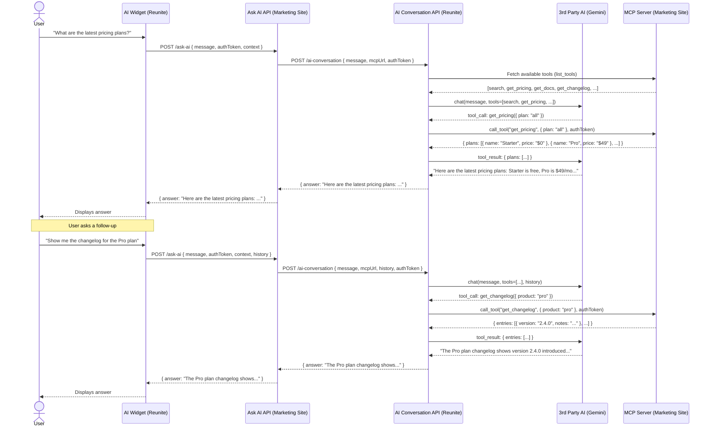

# MCP Integration Plan

## Flow Overview



## Implementation Plan

### Step 1 — Custom MCP Tool: `get_config`

Create a custom MCP tool on the Marketing Site that calls the Reunite `getProject` endpoint to fetch project configuration.

**Tool definition:**
```ts
{
  name: "get_config",
  description: "Fetches the current project configuration from Reunite",
  schema: {
    type: "object",
    properties: {},
    required: []
  },
  handler: async (args, context) => {
    const response = await fetch(`${REUNITE_API_URL}/projects/${projectId}`, {
      headers: { Authorization: `Bearer ${context.accessToken}` }
    });
    return response.json();
  }
}
```

The tool is registered in the Marketing Site MCP server alongside other tools. When Gemini decides to call it, Reunite's AI Conversation API proxies the call to the MCP server, which in turn calls the Reunite `getProject` REST endpoint on behalf of the authenticated user.

---

### Step 2 — Confirming the Call Originates from the Reunite Widget

Two viable approaches:

**Option A — Custom request header (recommended)**
The widget sets a header on every request to the Marketing Site Ask AI endpoint:
```
X-Reunite-Origin: true
X-Reunite-Project-Id: <projectId>
```
The Ask AI API forwards these to the AI Conversation API, which includes them in the `Authorization` context forwarded to the MCP server.

**Tool exposure based on origin:**
The MCP server uses `X-Reunite-Origin` to decide which tools to expose:
- **With `X-Reunite-Origin: true`** — expose all registered tools, including privileged ones (e.g. `get_config`, `get_logs`, `get_billing`)
- **Without `X-Reunite-Origin`** — expose only the default public tools (e.g. `search`, `get_docs`, `get_pricing`)

This means external MCP clients (e.g. Claude Desktop, VS Code) connecting directly to the MCP server get a safe subset of tools, while the Reunite widget gets the full set needed for the AI assistant experience.

**Option B — Referrer / Origin header**
Check `Origin` or `Referrer` on the incoming request. Less reliable (can be spoofed, stripped by proxies) and not sufficient on its own — should be used as a secondary check only.

**Recommendation:** Use Option A. A signed or verified `X-Reunite-Origin` header (e.g. HMAC-signed with a shared secret) provides both origin confirmation and tamper resistance without requiring a separate auth flow.

---

### Step 3 — Passing the Token from Widget through to the MCP Tool Call

Flow:
1. Widget sends `authToken` (Reunite session JWT) to Marketing Site Ask AI API
2. Ask AI API forwards `authToken` to Reunite AI Conversation API in the `Authorization` header
3. AI Conversation API includes the token in every MCP tool call request: `Authorization: Bearer <authToken>`
4. MCP Server receives the token, extracts it from the `Authorization` header, and passes it to the tool handler via `context.accessToken`

This mirrors the pattern already implemented for the semantic search fix — the Bearer JWT (with embedded `idp_access_token`) flows through unchanged.

---

### Step 4 — Permissions Handling in Tool Calls

When a tool calls an upstream API (e.g. Reunite `getProject`) using the user's token and receives a `401` or `403` response, the tool must not propagate the raw HTTP error. Instead it should return a standardised "no permissions" response so the AI can communicate this clearly to the user.

**Default error response for permission failures:**
```ts
if (response.status === 401 || response.status === 403) {
  return {
    content: [{ type: 'text', text: 'You do not have permission to access this resource.' }],
    isError: true,
  };
}
```

This applies to all privileged tools. The AI engine will receive this as a tool result and can relay it to the user naturally ("It seems you don't have access to that.") rather than surfacing a raw API error.

---

### Step 5 — How to Pass the Token to MCP When the Call Is on the Reunite Side

**The problem:** MCP connections are typically established once at session setup (SSE or Streamable HTTP transport). The token is not part of individual tool call messages — it must be established at connection time.

**Options:**

**Option A — Token in MCP connection setup (recommended)**
When Reunite's AI Conversation API establishes the MCP session with the Marketing Site MCP server, it includes the token in the initial HTTP request:
```
Authorization: Bearer <authToken>
```
The MCP server stores this token for the lifetime of the session and attaches it to all tool call contexts. This is the cleanest approach and is already supported by the Streamable HTTP transport (the `Authorization` header on the initial `POST /mcp` request is available via `authInfo` on the server).

**Option B — Token injected per tool call via MCP `_meta`**
The MCP protocol allows passing arbitrary metadata in `_meta` on each `tools/call` request. Reunite can inject the token there:
```json
{ "_meta": { "authToken": "..." } }
```
The MCP server reads it from `extra._meta`. This works but is non-standard and couples the MCP server to this convention.

**Option C — Token baked into the MCP URL**
Pass the token as a query param when registering the MCP server URL:
```
https://marketing-site.com/mcp?token=<authToken>
```
Simple but the token is exposed in logs and URLs. Not recommended for sensitive tokens.

**Recommendation:** Option A. The token is passed once at MCP session establishment via the `Authorization` header, stored server-side for the session, and injected into `context.accessToken` for every tool call — exactly the pattern used in the current `docs-mcp-handler` implementation.

---

## 1. MCP Tools on the Marketing Site

- MCP tools should be defined and managed on the marketing site
- Tools configuration (name, description, schema) lives alongside the site content
- Marketing site acts as the source of truth for available tools

## 2. Auth Token via AI Widget

- The auth token should be passed through the AI widget, following the same pattern as other parameters (e.g. user context, product filters)
- Widget receives the token from the reunite session and forwards it to the MCP server with each tool call
- No separate auth flow needed for the widget — reuses existing session token

## 3. Custom Guards for Whitelisted Endpoints

- Create custom guards for sensitive endpoints that should only be accessible to specific roles/teams
- Examples of endpoints requiring guards:
  - `GET /logs` — access to system or audit logs
  - `GET /billing` — access to billing information
- Guards should be declarative and applied per-endpoint
- Whitelisted endpoints bypass standard RBAC but still require explicit guard configuration

---

## Next MCP Tools to Implement

### Tool 1 — `get-project-build-logs`

**Purpose:** Let the AI assistant answer questions about build status, failures, and log output for a given project. Without a `buildId` returns a list of recent builds; with a `buildId` returns the full log lines for that build.

**Two API endpoints involved:**

**1a. List builds** — `GET /api/orgs/{orgId}/projects/{projectId}/builds`
(`listProjectBuilds` — `paths/project-builds/project-builds.yaml`)
- Auth: `UserCookie`
- Used when no `buildId` provided — returns paginated build metadata

**1b. Single build with logs** — `GET /api/orgs/{orgId}/projects/{projectId}/builds/{buildId}`
(`getProjectBuild` — `paths/project-builds/project-build.yaml`)
- Auth: `InternalAuth`
- Returns `ProjectBuildDetailedResponse` which includes a `logs[]` array: `{ id, log, date, sortOrder }`
- Used when `buildId` is provided — log lines are embedded directly in the response

**Args:**
| arg | type | description |
|---|---|---|
| `org` | `string` | Org slug or ID |
| `project` | `string` | Project slug or ID |
| `buildId` | `string` (optional) | Build ID (`pb_` prefixed). When provided, fetches the build and returns its `logs[]`. When omitted, returns the list of recent builds. |
| `limit` | `number` (optional) | Max builds to return when listing (default 10) |

**Handler logic:**
```
if buildId provided:
  GET /builds/{buildId}  → return build.logs[]
else:
  GET /builds?limit={limit}  → return build list (id, status, createdAt, finishedAt, branchName)
```

---

### Tool 2 — `get-billing-info`

**Purpose:** Let the AI assistant answer questions about the org's current subscription plan and status.

**API endpoint:** `GET /api/orgs/{orgId}/subscription-status`
(`listSubscriptionsStatuses` — `paths/subscription/subscriptions-statuses.yaml`)

**Args:**
| arg | type | description |
|---|---|---|
| `org` | `string` | Org slug or ID |

**Notes:**
- Uses `UserCookie` auth — standard cookie pattern applies
- Returns subscription plan, status, and feature entitlements
- Sensitive endpoint — should only be exposed when `isReuniteOrigin` is true (same guard pattern described in Step 2 of this plan)
- Return only plan name, status, and seat/limit info — omit payment method or raw billing details

---

### Tool 3 — `get-org-members`

**Purpose:** Let the AI assistant answer questions about org members — who has access, roles, etc.

**API endpoint:** `GET /api/orgs/{orgId}/members`
(`listMembers` — `paths/memberships/members.yaml`)

**Args:**
| arg | type | description |
|---|---|---|
| `org` | `string` | Org slug or ID |
| `limit` | `number` (optional) | Max number of members to return (default 20) |
| `search` | `string` (optional) | Filter members by name or email |

**Notes:**
- Auth: `UserCookie` — requires `MEMBERS_READ` permission
- Returns `MemberList` — each item is a `Member` with `id`, `name`, `email`, `role`, `firstName`, `lastName`
- Should only be exposed when `isReuniteOrigin: true` to prevent external MCP clients from enumerating org members

---

### Implementation order

1. `get-org-members` — simplest, standard cookie auth, no sensitivity concerns beyond origin check
2. `get-project-build-logs` — slightly more complex due to pagination, but same auth pattern
3. `get-billing-info` — most sensitive, do last after origin guard is confirmed working
